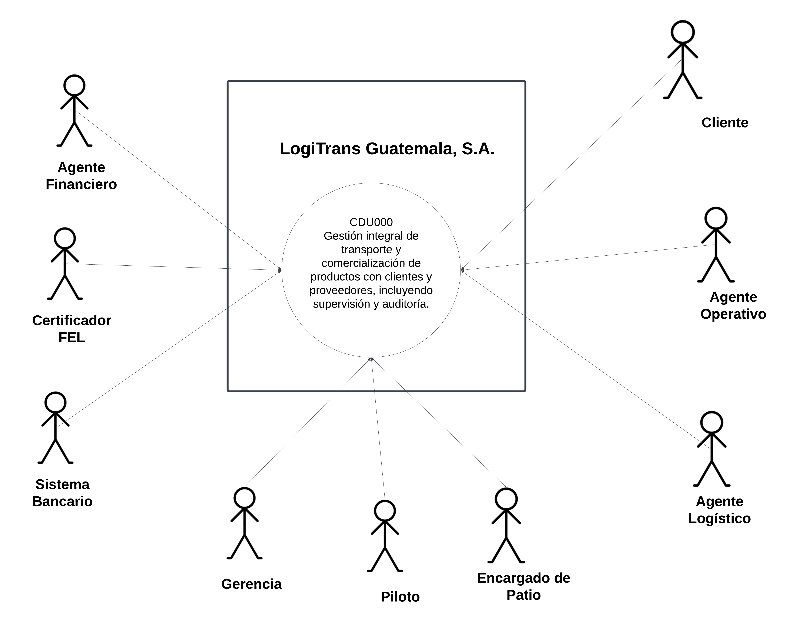
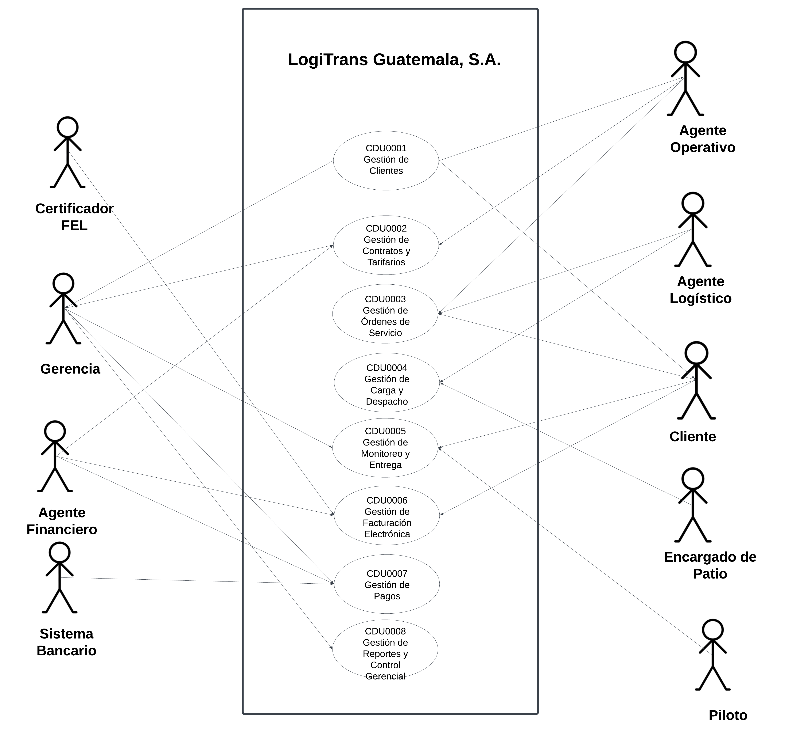
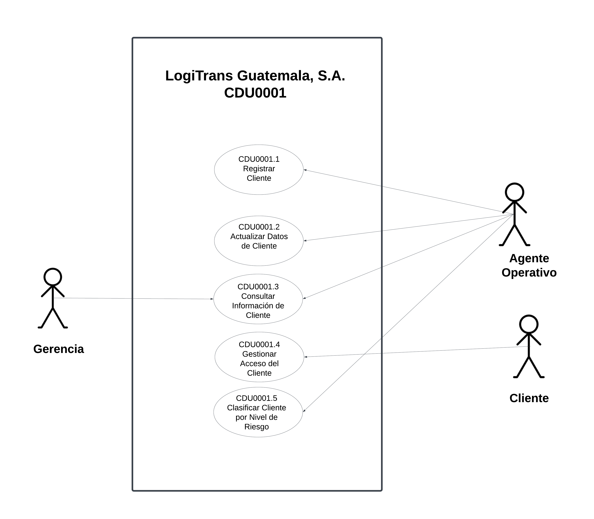
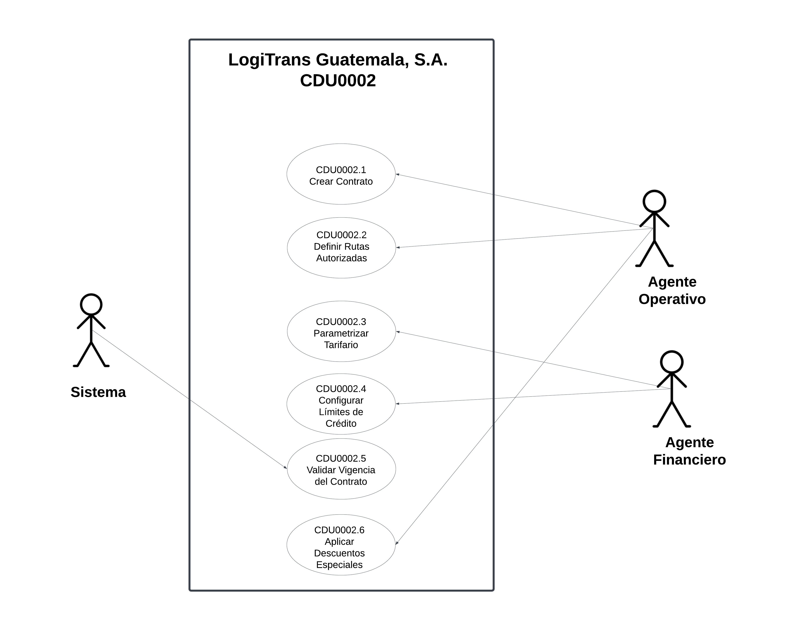
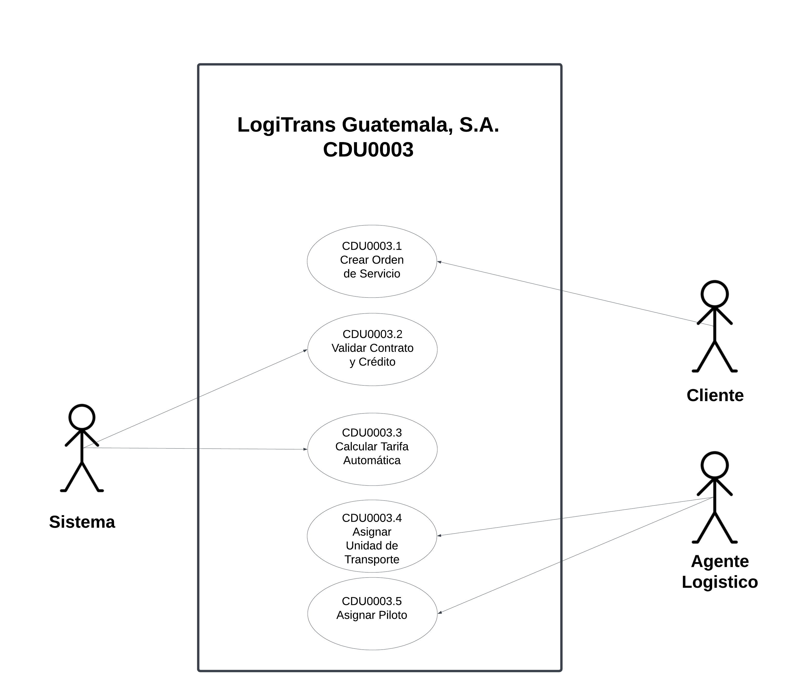
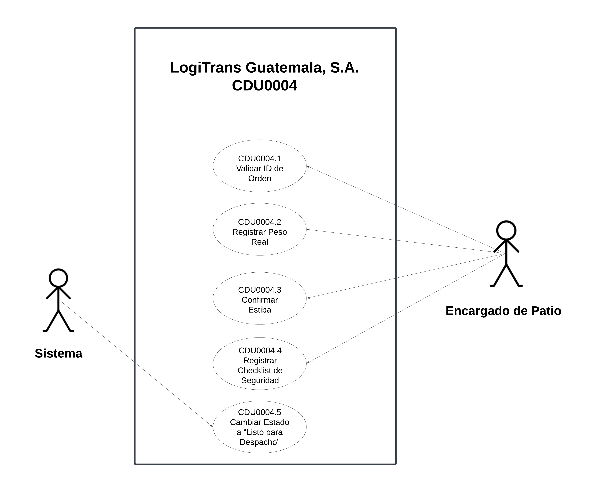
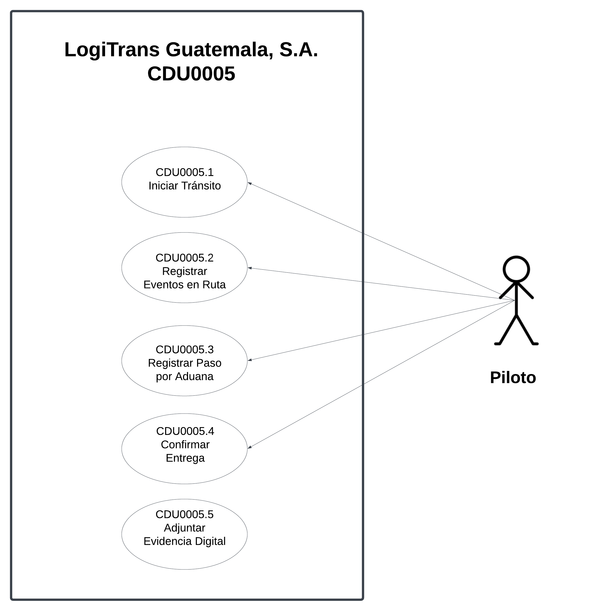
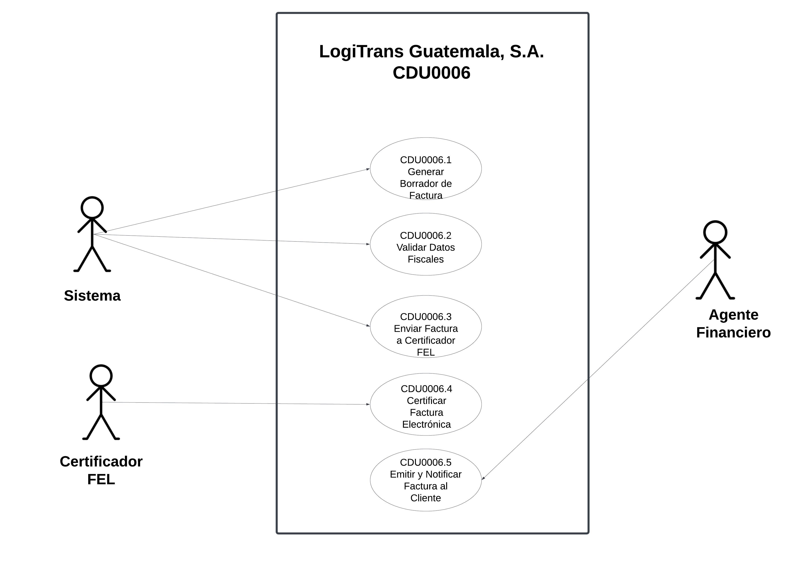
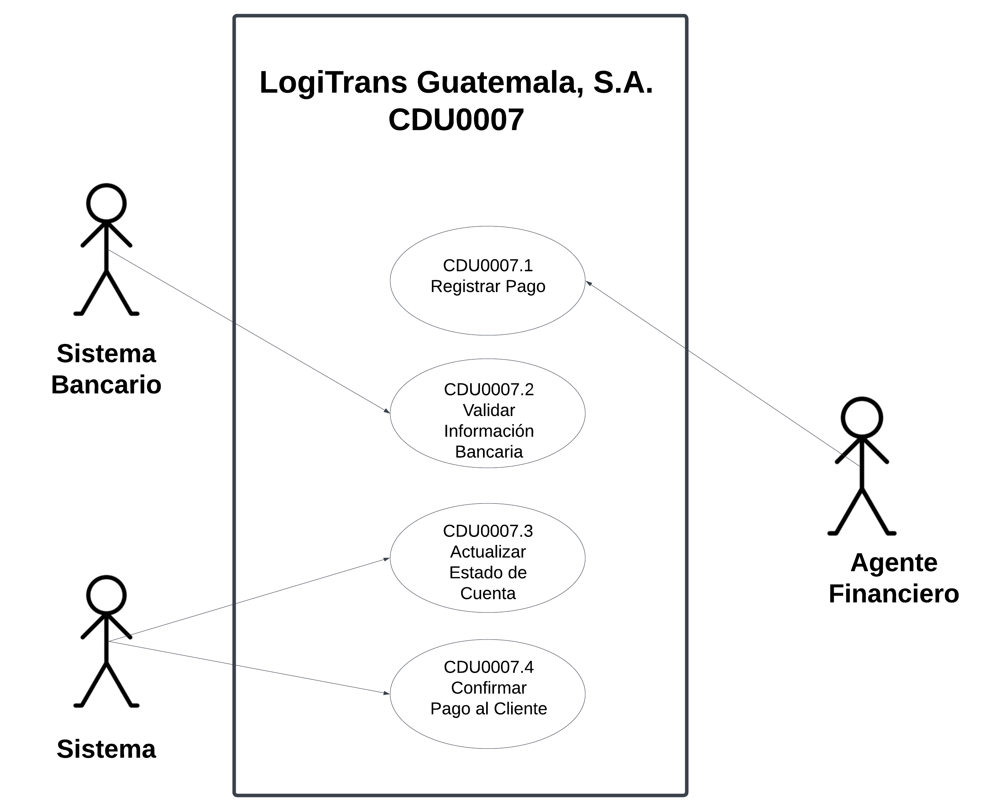
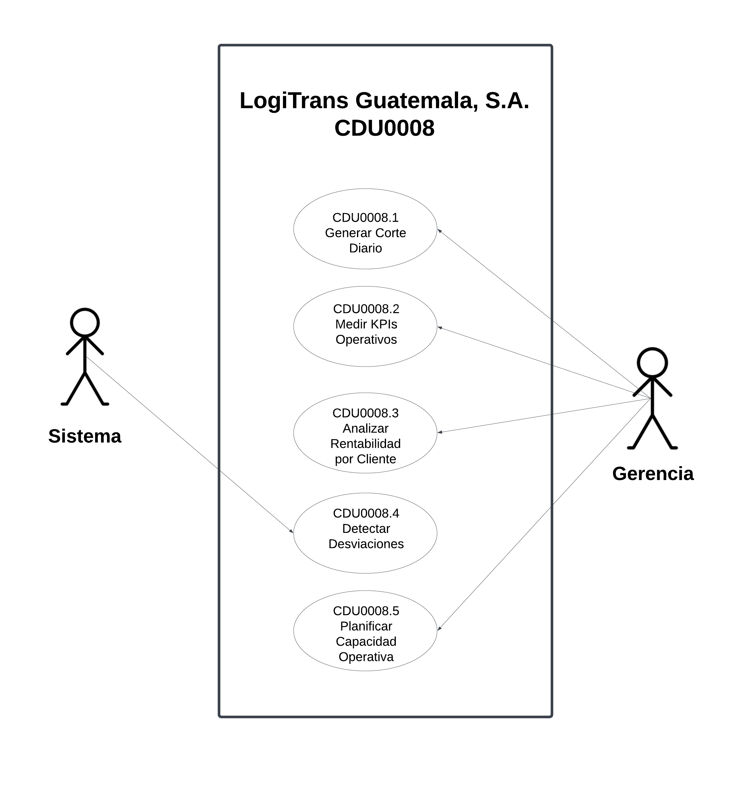

## Documento de Decision de Arquitectura(DDA)

## Indice
- [Documento de Decisión de Arquitectura (DDA)](#documento-de-decisión-de-arquitectura-dda)
  - [Indice](#indice)
  - [1. Diagrama de casos de uso del megocio de Alto nivel](#1-Diagrama-de-casos-de-uso-del-negocio-de-alto-nivel)
  - [2. Primera Descomposicion](#2-primera-descomposicion)
  - [3.Listado de Stakeholders y preocupaciones arquitectónicas](#3listado-de-stakeholders-y-preocupaciones-arquitectónicas)
    - [3.1 Stakeholders](#31-stakeholders)
    - [3.2 Preocupaciones Arquitectonicas](#32-preocupaciones-arquitectonicas)
  - [4.Actores del sistema](#4-actores-del-sistema)
  - [5. Caracteristicas del Sistema](#5-caracteristicas-del-sistema)
    - [5.1 Prioridad Alta](#51-prioridad-alta)
        - [5.1.1 Escalabilidad](#511-escalabilidad)
        - [5.1.2. Disponibilidad](#512-disponibilidad)
        - [5.1.3. Seguridad](#513-seguridad)
        - [5.1.4. Rendimiento](#514-rendimiento)
        - [5.1.5. Integridad de Datos](#515-integridad-de-datos)
        - [5.1.6. Confiabilidad](#516-confiabilidad)
        - [5.1.7. Interoperabilidad](#517-interoperabilidad)
    - [5.2 Prioridad Media](#52-prioridad-media)
        - [5.2.1 Mantenibilidad](#521-mantenibilidad)
        - [5.2.2 Modularidad](#522-modularidad)
        - [5.2.3 Portabilidad](#523-portabilidad)
        - [5.2.4 Usabilidad](#524-usabilidad)
        - [5.2.5 Auditabilidad](#525-auditabilidad)
        - [5.2.6 Extensibilidad](#526-extensibilidad)
    - [5.3  Prioridad Baja ](#53--prioridad-baja)
        - [5.3.1 Experiencia de Usuario (UX avanzada)](#531-experiencia-de-usuario-ux-avanzada)
        - [5.3.2 Internacionalización](#532-internacionalización)
        - [5.3.3 Optimización de Costos en Infraestructura](#533-optimización-de-costos-en-infraestructura)
  - [6. Drivers Requisitos Funcionales](#6-drivers-requisitos-funcionales)
    - [6.1 Requisitos Funcionales](#61-requisitos-funcionales)
        - [6.1.1. Gestión de Clientes y Contratos](#611-gestión-de-clientes-y-contratos)
        - [6.1.2. Registro y Seguimiento de Ordenes de Servicio](#612-registro-y-seguimiento-de-ordenes-de-servicio)
        - [6.1.3. Facturación Electrónica](#613-facturación-electrónica)
        - [6.1.4. Reportes Operativos y Gerenciales](#614-reportes-operativos-y-gerenciales)
        - [6.1.5. Gestión de Activos y Capital Humano](#615-gestión-de-activos-y-capital-humano)
    - [6.2 Expandidos para CDU001](#62-expandidos-para-cdu001)
        - [6.2.1 CDU001.1 - Registrar Cliente](#621-cdu0011---registrar-cliente)
    - [6.3 Expandidos para CDU002](#63-expandidos-para-cdu002)
        - [6.3.1 CDU002.1 - Crear Contrato](#631-cdu0021---crear-contrato)
    - [6.4 Expandidos para CDU003](#64-expandidos-para-cdu003)
        - [6.4.1 CDU003.1 - Crear Orden de Servicio](#641-cdu0031---crear-orden-de-servicio)
    - [6.5 Expandidos para CDU004](#65-expandidos-para-cdu004)
        - [6.5.1 CDU004.1 - Validar ID de Orden](#651-cdu0041---validar-id-de-orden)
    - [6.6 Expandidos para CDU005](#66-expandidos-para-cdu005)
        - [6.6.1 CDU005.1 -  Iniciar Transito](#661-cdu0051----iniciar-transito)
    - [6.7 Expandidos para CDU006](#67-expandidos-para-cdu006)
        - [6.7.1 CDU006.1 - Generar Borrador de Factura ](#671-cdu0061---generar-borrador-de-factura)
    - [6.8 Expandidos para CDU007](#68-expandidos-para-cdu007)
        - [6.8.1 CDU007.1 - Registrar Pago](#681-cdu0071---registrar-pago)
    - [6.9 Expandidos para CDU008](#69-expandidos-para-cdu008)
        - [6.9.1 CDU008.1 - Generar Corte ](#691-cdu0081---generar-corte-diario)
  - [7. Drivers de Calidad](#7-drivers-de-calidad)
    - [7.1 Requisitos No funcionales](#71-requisitos-no-funcionales)
    - [7.2 DRIVER DE CALIDAD: ESCALABILIDAD](#72-driver-de-calidad-escalabilidad)
    - [7.3 DRIVER DE CALIDAD: DISPONIBILIDAD](#73-driver-de-calidad-disponibilidad)
    - [7.4 DRIVER DE CALIDAD: RECUPERACIÓN ANTE FALLAS](#74-driver-de-calidad-recuperación-ante-fallas)
    - [7.5 DRIVER DE CALIDAD: SEGURIDAD](#75-driver-de-calidad-seguridad)
    - [7.6 DRIVER DE CALIDAD: AUDITORÍA](#76-driver-de-calidad-auditoría)
    - [7.7 DRIVER DE CALIDAD: RENDIMIENTO](#77-driver-de-calidad-rendimiento)
    - [7.8 DRIVER DE CALIDAD: INTEROPERABILIDAD](#78-driver-de-calidad-interoperabilidad)
    - [7.9 DRIVER DE CALIDAD: USABILIDAD](#79-driver-de-calidad-usabilidad)
    - [7.10 DRIVER DE CALIDAD: MANTENIBILIDAD](#710-driver-de-calidad-mantenibilidad)
    - [ 7.11 DRIVER DE CALIDAD: RESPALDO Y PROTECCIÓN DE DATOS](#711-driver-de-calidad-respaldo-y-protección-de-datos)
  - [8. Drivers de Restriccion](#8-drivers-de-restriccion)
    - [8.1 DR-01 – Restricción Tecnológica (Frontend Framework)](#81-dr-01--restricción-tecnológica-frontend-framework)
    - [8.2  DR-02 – Restricción Tecnológica (Tipado Estricto en Frontend)](#82--dr-02--restricción-tecnológica-tipado-estricto-en-frontend)
    - [8.3 DR-03 – Restricción Tecnológica (Backend)](#83-dr-03--restricción-tecnológica-backend)
    - [8.4 DR-04 – Restricción Tecnológica (Framework Backend)](#84-dr-04--restricción-tecnológica-framework-backend)
    - [8.5 DR-05 – Restricción de Base de Datos](#85-dr-05--restricción-de-base-de-datos)
    - [8.6 DR-06 – Restricción de Estilo Visual](#86-dr-06--restricción-de-estilo-visual)
    - [ 8.7 DR-07 – Restricción de Librerías UI](#87-dr-07--restricción-de-librerías-ui)
    - [8.8 DR-08 – Restricción de Recursos Visuales](#88-dr-08--restricción-de-recursos-visuales)
    - [8.9 DR-09 – Restricción de Contenerización](#89-dr-09--restricción-de-contenerización) 
    - [8.10 DR-10 – Restricción de Orquestación y Despliegue Estandarizado](#810-dr-10--restricción-de-orquestación-y-despliegue-estandarizado)
    - [8.11 DR-11 – Restricción de Plataforma en la Nube](#811-dr-11--restricción-de-plataforma-en-la-nube)
  - [9. Matriz de Trazabilidad](#9-matriz-de-trazabilidad)
    - [9.1 Matriz RF VS Stakeholders](#91-matriz-rf-vs-stakeholders)
    - [9.2 Matriz RF VS RNF](#92-matriz-rf-vs-rnf)
    - [9.3 Matriz CDU VS EAC](#93-matriz-cdu-vs-eac)
    - [9.4 Matriz CDU VS Actores](#94-matriz-cdu-vs-actores)

---
## 1. Diagrama de casos de uso del negocio de Alto nivel

## 2. Primera Descomposicion

## 3.Listado de Stakeholders y preocupaciones arquitectónicas

### 3.1. Stakeholders

| Stakeholder           | Tipo    | Rol                       | Intereses Principales                                                      |
| --------------------- | ------- | ------------------------- | -------------------------------------------------------------------------- |
| Gerente General       | Interno | Patrocinador del proyecto | Minimizar costos, ROI rápido, expansión regional                           |
| Gerente de TI         | Interno | Responsable técnico       | Arquitectura robusta, mantenibilidad, escalabilidad, preparación para nube |
| Jefe de Operaciones   | Interno | Usuario operativo clave   | Rapidez del sistema, facilidad de uso, eficiencia operativa                |
| Área Financiera       | Interno | Control presupuestario    | Control de costos, cumplimiento fiscal (FEL), integridad contable          |
| Clientes Corporativos | Externo | Usuarios externos         | Disponibilidad 24/7, trazabilidad en tiempo real, seguridad de información |
| Equipo de Desarrollo  | Interno | Constructores del sistema | Tecnologías conocidas, bajo riesgo técnico, cumplimiento en 4 semanas      |

### 3.2. Preocupaciones Arquitectonicas

| Stakeholder           | Preocupaciones Arquitectónicas                                                     |
| --------------------- | ---------------------------------------------------------------------------------- |
| Gerente General       | Costo vs escalabilidad, tiempo de implementación, beneficio tangible a corto plazo |
| Gerente de TI         | Evitar soluciones temporales, seguridad, calidad estructural                       |
| Jefe de Operaciones   | Tiempo de respuesta bajo, interfaz simple, alta disponibilidad                     |
| Área Financiera       | Exactitud en facturación, trazabilidad, auditoría, cumplimiento con SAT            |
| Clientes Corporativos | SLA 99.5%, acceso remoto confiable, protección de datos                            |
| Equipo de Desarrollo  | Complejidad excesiva, tecnologías experimentales, tiempo limitado                  |

## 4. Actores del Sistema

| Actor              | Tipo    | Descripción del Rol                                                                                  |
| ------------------ | ------- | ---------------------------------------------------------------------------------------------------- |
| Cliente            | Externo | Empresa que solicita servicios de transporte, crea órdenes y consulta el estado de sus envíos.       |
| Agente Operativo   | Interno | Gestiona clientes, contratos y generación de órdenes de servicio.                                    |
| Agente Logístico   | Interno | Asigna unidades y pilotos, coordina la planificación operativa.                                      |
| Encargado de Patio | Interno | Registra peso real, valida ID de orden, confirma estiba y checklist de seguridad antes del despacho. |
| Piloto             | Interno | Ejecuta el servicio de transporte, actualiza estados y registra evidencia de entrega.                |
| Agente Financiero  | Interno | Gestiona facturación electrónica, estado de cuenta y registro de pagos.                              |
| Gerencia           | Interno | Supervisa reportes, KPIs y control estratégico del negocio.                                          |
| Certificador FEL   | Externo | Sistema externo que valida y certifica facturas electrónicas conforme a la SAT.                      |
| Sistema Bancario   | Externo | Sistema externo que valida o procesa pagos electrónicos.                                             |

## 5. Caracteristicas del Sistema

| Stakeholder           | Tipo    | Rol                       | Intereses Principales                                                      |
| --------------------- | ------- | ------------------------- | -------------------------------------------------------------------------- |
| Gerente General       | Interno | Patrocinador del proyecto | Minimizar costos, ROI rápido, expansión regional                           |
| Gerente de TI         | Interno | Responsable técnico       | Arquitectura robusta, mantenibilidad, escalabilidad, preparación para nube |
| Jefe de Operaciones   | Interno | Usuario operativo clave   | Rapidez del sistema, facilidad de uso, eficiencia operativa                |
| Área Financiera       | Interno | Control presupuestario    | Control de costos, cumplimiento fiscal (FEL), integridad contable          |
| Clientes Corporativos | Externo | Usuarios externos         | Disponibilidad 24/7, trazabilidad en tiempo real, seguridad de información |
| Equipo de Desarrollo  | Interno | Constructores del sistema | Tecnologías conocidas, bajo riesgo técnico, cumplimiento en 4 semanas      |

### 5.1 Prioridad Alta

#### 5.1.1 Escalabilidad

El sistema debe soportar un crecimiento mínimo del 200% en volumen de órdenes, usuarios y transacciones sin degradación significativa del rendimiento.

**Motivo:** Expansión regional y aumento de clientes corporativos.

#### 5.1.2. Disponibilidad

La plataforma debe garantizar una disponibilidad mínima del 99.5%.

**Motivo:** La operación logística depende del sistema en tiempo real.

#### 5.1.3. Seguridad

El sistema debe proteger datos financieros, contratos y facturación electrónica mediante autenticación, autorización por roles y control de acceso.

**Motivo:** Se manejan datos sensibles y obligaciones fiscales.

#### 5.1.4. Rendimiento

El sistema debe responder en tiempos menores a 2–3 segundos en operaciones críticas (registro de órdenes, consulta de estado, facturación).

**Motivo:** Operadores trabajan bajo presión operativa.

#### 5.1.5. Integridad de Datos

La información de órdenes, rutas, contratos y facturación debe mantenerse consistente y libre de corrupción.

**Motivo:** Errores pueden generar pérdidas económicas.

#### 5.1.6. Confiabilidad

El sistema debe minimizar fallos y garantizar que las transacciones se completen correctamente.

**Motivo:** La logística no puede depender de procesos inestables.

#### 5.1.7. Interoperabilidad

Debe permitir integración con sistemas externos como:

- Aduanas
- ERP corporativo
- Sistemas de facturación electrónica (FEL)

**Motivo:** Automatización y expansión regional.

### 5.2 Prioridad Media

#### 5.2.1 Mantenibilidad

El sistema debe permitir modificaciones y mejoras sin afectar gravemente su estructura.

**Motivo:** El negocio evolucionará constantemente.

#### 5.2.2 Modularidad

La arquitectura debe permitir separar frontend, backend y base de datos de forma desacoplada.

**Motivo:** Facilita escalabilidad y mantenimiento.

#### 5.2.3 Portabilidad

El sistema debe poder desplegarse en distintos entornos sin grandes cambios.

**Motivo:** Uso de contenedores y posible migración futura.

#### 5.2.4 Usabilidad

La interfaz debe ser intuitiva para operadores logísticos y personal administrativo.

**Motivo:** Reduce errores humanos y tiempos de capacitación.

#### 5.2.5 Auditabilidad

El sistema debe registrar acciones críticas (modificación de órdenes, cambios de estado, facturación).

**Motivo:** Cumplimiento normativo y control interno.

#### 5.2.6 Extensibilidad

Debe permitir agregar nuevos módulos (por ejemplo, módulo internacional o seguimiento satelital).

**Motivo:** Plan de expansión a otros países.

### 5.3  Prioridad Baja 

#### 5.3.1 Experiencia de Usuario (UX avanzada)

Uso de animaciones, ilustraciones y diseño moderno.

**Motivo:** Mejora percepción del producto, pero no afecta operación crítica.

#### 5.3.2 Internacionalización

Capacidad futura de soportar múltiples idiomas y monedas.

**Motivo:** Expansión regional.

#### 5.3.3 Optimización de Costos en Infraestructura

Uso eficiente de recursos cloud.

**Motivo:** No es prioridad inicial, pero importante a largo plazo.

## 6. Drivers Requisitos Funcionales
### 6.1 Requisitos Funcionales

#### 6.1.1. Gestión de Clientes y Contratos

- El sistema permite registrar empresas clientes capturando datos fiscales,
contactos clave, categoría de riesgo e información de acceso para la plataforma.

- El sistema permite a los clientes iniciar sesión con correo y contraseña, aplicando
estrategias de protección y recuperación en caso de extravío o hurto.

- El sistema permite a los clientes gestionar sus datos, crear órdenes de servicio y
dar seguimiento a sus envíos desde la plataforma.

- El sistema permite a un agente operativo generar contratos digitales por cliente,
definiendo rutas autorizadas, tipos de carga permitidos, límite de crédito y plazos
de pago.

- El sistema permite al área de contabilidad parametrizar y modificar el tarifario
según tipo de unidad, así como agregar descuentos especiales por contrato.

- El sistema valida automáticamente la vigencia del contrato y las condiciones de
crédito del cliente antes de autorizar cualquier operación, bloqueando la
generación de nuevas órdenes si el cliente tiene facturas vencidas o ha alcanzado
su límite de crédito.

- El sistema vincula automáticamente cada orden de servicio con el contrato
correspondiente, asignando la tarifa y los requisitos de transporte sin intervención
manual del personal operativo.

- El sistema actualiza el historial del cliente al cierre de cada servicio, registrando
volumen de carga movida, puntualidad en pagos y siniestralidad para alimentar el
tablero de control gerencial.

#### 6.1.2. Registro y Seguimiento de Ordenes de Servicio
- El sistema permite generar órdenes de servicio capturando origen, destino, tipo de
mercancía y peso, validando automáticamente que el cliente no tenga bloqueos
administrativos y asignando la tarifa del contrato vigente.

- El sistema permite a un agente logístico asignar la unidad de transporte y el piloto
disponibles, verificando que el vehículo cumpla requisitos técnicos y que el piloto
tenga documentos vigentes para la ruta asignada.

- El sistema permite al encargado de patio registrar el proceso de carga mediante la
validación del ID de la orden, registro del peso real cargado verificando que no se
exceda de lo establecido en cada vehículo, confirmación de estiba y checklist de
seguridad que cambia automáticamente el estado de la orden a "Listo para
Despacho".

- El sistema permite al piloto cambiar el estado de la orden a "En Tránsito" al iniciar el
viaje y registrar eventos clave como la salida del predio, paso por puntos de control
o aduanas en una bitácora centralizada.

- El sistema permite al piloto registrar la entrega final adjuntando evidencia digital
válida, disparando automáticamente una notificación al departamento de
facturación.

- El sistema genera indicadores de rendimiento (KPIs) al cierre de cada orden,
comparando tiempos reales de entrega contra los planificados para identificar
cuellos de botella por ruta.

#### 6.1.3. Facturación Electrónica
- El sistema genera automáticamente un borrador de factura cuando el piloto marca
la orden como "Entregada", consolidando los datos de la orden sin intervención
manual.

- El sistema envía el borrador al certificador FEL para validar el NIT, verificar campos
obligatorios establecidos en el sistema y cumplir con la normativa de la SAT de
Guatemala.

- El sistema permite al agente financiero certificar la factura validada, obteniendo el
documento oficial FEL con firma y número de autorización.

- El sistema envía automáticamente la factura certificada al correo electrónico
registrado del cliente y la almacena en su expediente digital.

- El sistema actualiza automáticamente el estado de cuenta del cliente en el módulo
financiero por cada factura emitida, programando la fecha de vencimiento según
los términos del contrato.

- El sistema permite al agente financiero registrar pagos sobre facturas, capturando
forma de pago, fecha, hora y monto exacto y en caso de cheque o transferencia,
registrando banco origen, cuenta y número de autorización bancaria.

#### 6.1.4. Reportes Operativos y Gerenciales
- El sistema genera un corte de operaciones diario consolidando servicios
completados, facturas emitidas e incidentes reportados en las tres sedes
establecidas.

- El sistema presenta un dashboard con KPIs de cumplimiento, comparando tiempos
de entrega reales vs. prometidos por ruta.

- El sistema realiza análisis de rentabilidad cruzando ingresos por contrato frente a
gastos operativos.

- El sistema detecta y notifica automáticamente anomalías operativas, como rutas
con exceso de consumo o clientes con caída repentina en volumen de carga.

- El sistema proyecta necesidades de capacidad basándose en el volumen de carga
histórico de los últimos meses.

#### 6.1.5. Gestión de Activos y Capital Humano
- El sistema permite registrar, actualizar y consultar vehículos de la flota con sus
características técnicas.

- El sistema permite registrar pilotos con sus datos personales y documentos
vigentes, alertando cuando alguno de estos esté próximo a vencer.

- El sistema permite gestionar usuarios internos con sus respectivos roles y permisos
de acceso diferenciados.

### 6.2 Expandidos para CDU001
#### 6.2.1 CDU001.1 - Registrar Cliente

| Expandido             | CDU0001.1                                                                                                                                                                                                                                                                                                                                                                                                                                                                                                                                                                                                                                                                                                                                                                                                                                                            |
| --------------------- | -------------------------------------------------------------------------------------------------------------------------------------------------------------------------------------------------------------------------------------------------------------------------------------------------------------------------------------------------------------------------------------------------------------------------------------------------------------------------------------------------------------------------------------------------------------------------------------------------------------------------------------------------------------------------------------------------------------------------------------------------------------------------------------------------------------------------------------------------------------------- |
| **Nombre**            | Registrar Cliente                                                                                                                                                                                                                                                                                                                                                                                                                                                                                                                                                                                                                                                                                                                                                                                                                                                    |
| **Código**            | CDU0001.1                                                                                                                                                                                                                                                                                                                                                                                                                                                                                                                                                                                                                                                                                                                                                                                                                                                            |
| **Actores**           | Agente Operativo                                                                                                                                                                                                                                                                                                                                                                                                                                                                                                                                                                                                                                                                                                                                                                                                                                                     |
| **Descripción**       | Permite registrar un nuevo cliente en el sistema, capturando sus datos básicos y validando que no exista previamente.                                                                                                                                                                                                                                                                                                                                                                                                                                                                                                                                                                                                                                                                                                                                                |
| **Precondiciones**    | El Agente Operativo debe haber iniciado sesión; El sistema debe estar disponible.                                                                                                                                                                                                                                                                                                                                                                                                                                                                                                                                                                                                                                                                                                                                                                                    |
| **Post Condiciones**  | Cliente registrado en el sistema; Se genera un identificador de cliente; Los datos quedan disponibles para consulta y gestión de acceso.                                                                                                                                                                                                                                                                                                                                                                                                                                                                                                                                                                                                                                                                                                                             |
| **Flujo principal**   | 1. El Agente Operativo accede al módulo **Clientes**. 2. El Agente Operativo selecciona la opción **Registrar Cliente**. 3. El sistema muestra el formulario de registro. 4. El Agente Operativo ingresa los datos del cliente (ej. nombre, DPI/NIT, teléfono, correo, dirección). 5. El Agente Operativo presiona **Guardar**. 6. El sistema valida campos obligatorios y formato. 7. El sistema verifica que el **DPI/NIT** no esté registrado previamente. 8. El sistema registra al cliente y almacena la **fecha de registro** automáticamente. 9. El sistema muestra confirmación: **“Cliente registrado exitosamente”**.                                                                                                                                                                                                              |
| **Flujos alternos**   | **FA1: DPI/NIT ya registrado** FA1.1 El sistema detecta duplicidad del DPI/NIT. FA1.2 El sistema muestra: **“El cliente ya existe”**. FA1.3 El caso de uso finaliza sin registrar.  **FA2: Campos obligatorios vacíos** FA2.1 El sistema valida y detecta campos vacíos. FA2.2 El sistema muestra: **“Complete los campos obligatorios”**. FA2.3 El caso de uso regresa al paso 4.  **FA3: Formato inválido (correo/teléfono/DPI)** FA3.1 El sistema detecta formato incorrecto. FA3.2 El sistema muestra: **“Formato inválido, verifique los datos”**. FA3.3 El caso de uso regresa al paso 4.  **FA4: Error al guardar (BD/servidor)** FA4.1 El sistema no logra completar el registro. FA4.2 El sistema muestra: **“Error al registrar, intente nuevamente”**. FA4.3 El caso de uso finaliza sin registrar. |
| **Reglas de negocio** | **RN-01:** El DPI/NIT debe ser único por cliente. **RN-02:** Nombre y DPI/NIT son obligatorios. **RN-03:** La fecha de registro se genera automáticamente por el sistema. **RN-04:** Solo usuarios con rol **Agente Operativo** pueden registrar clientes.                                                                                                                                                                                                                                                                                                                                                                                                                                                                                                                                                                                                  |
| **Reglas de calidad** | **RC-01:** El registro debe completarse en menos de **3 segundos** (sin contar digitación). **RC-02:** Mensajes de validación deben ser claros y específicos por campo. **RC-03:** La información debe guardarse con integridad (transacción: todo o nada).                                                                                                                                                                                                                                                                                                                                                                                                                                                                                                                                                                                                    |

### 6.3 Expandidos para CDU002
#### 6.3.1 CDU002.1 - Crear Contrato

| Expandido             | CDU0002.1                                                                                                                                                                                                                                                                                                                                                                                                                                                                                                                                                |
| --------------------- | -------------------------------------------------------------------------------------------------------------------------------------------------------------------------------------------------------------------------------------------------------------------------------------------------------------------------------------------------------------------------------------------------------------------------------------------------------------------------------------------------------------------------------------------------------- |
| **Nombre**            | Crear Contrato                                                                                                                                                                                                                                                                                                                                                                                                                                                                                                                                           |
| **Código**            | CDU0002.1                                                                                                                                                                                                                                                                                                                                                                                                                                                                                                                                                |
| **Actores**           | Agente Operativo                                                                                                                                                                                                                                                                                                                                                                                                                                                                                                                                         |
| **Descripción**       | Permite crear un nuevo contrato para un cliente, estableciendo condiciones comerciales, vigencia y parámetros iniciales del servicio.                                                                                                                                                                                                                                                                                                                                                                                                                    |
| **Precondiciones**    | El cliente debe estar previamente registrado; El Agente Operativo debe estar autenticado en el sistema.                                                                                                                                                                                                                                                                                                                                                                                                                                                  |
| **Post Condiciones**  | Contrato registrado en el sistema; Se asigna número único de contrato; El contrato queda pendiente de validación financiera si aplica.                                                                                                                                                                                                                                                                                                                                                                                                                   |
| **Flujo principal**   | 1. El Agente Operativo accede al módulo **Contratos**. 2. Selecciona la opción **Crear Contrato**. 3. El sistema muestra formulario de contrato. 4. El Agente selecciona el cliente asociado. 5. El Agente ingresa condiciones del contrato (tipo de servicio, fechas, tarifas base). 6. El Agente presiona **Guardar**. 7. El sistema valida la información ingresada. 8. El sistema genera número único de contrato. 9. El sistema almacena el contrato. 10. El sistema muestra mensaje **“Contrato creado exitosamente”**. |
| **Flujos alternos**   | **FA1: Cliente no existe** FA1.1 El sistema detecta que el cliente no está registrado. FA1.2 El sistema muestra “Cliente no encontrado”. FA1.3 El caso de uso finaliza.  **FA2: Campos obligatorios vacíos** FA2.1 El sistema valida campos obligatorios. FA2.2 Muestra “Complete la información requerida”. FA2.3 Regresa al paso 5.  **FA3: Error al guardar** FA3.1 El sistema no puede almacenar el contrato. FA3.2 Muestra mensaje de error. FA3.3 El caso de uso finaliza sin guardar.                      |
| **Reglas de negocio** | **RN-01:** Cada contrato debe tener un número único. **RN-02:** Un contrato debe estar asociado a un cliente existente. **RN-03:** La fecha de inicio no puede ser posterior a la fecha de fin. **RN-04:** Solo el Agente Operativo puede crear contratos.                                                                                                                                                                                                                                                                                      |
| **Reglas de calidad** | **RC-01:** Tiempo de creación menor a 3 segundos. **RC-02:** Validaciones en tiempo real para fechas y datos obligatorios. **RC-03:** Registro transaccional (si falla, no se guarda parcialmente).                                                                                                                                                                                                                                                                                                                                                |

### 6.4 Expandidos para CDU003
#### 6.4.1 CDU003.1 - Crear Orden de Servicio

| Expandido             | CDU0003.1                                                                                                                                                                                                                                                                                                                                                                                                                                                                                                                                                                                                                                                                        |
| --------------------- | -------------------------------------------------------------------------------------------------------------------------------------------------------------------------------------------------------------------------------------------------------------------------------------------------------------------------------------------------------------------------------------------------------------------------------------------------------------------------------------------------------------------------------------------------------------------------------------------------------------------------------------------------------------------------------- |
| **Nombre**            | Crear Orden de Servicio                                                                                                                                                                                                                                                                                                                                                                                                                                                                                                                                                                                                                                                          |
| **Código**            | CDU0003.1                                                                                                                                                                                                                                                                                                                                                                                                                                                                                                                                                                                                                                                                        |
| **Actores**           | Cliente                                                                                                                                                                                                                                                                                                                                                                                                                                                                                                                                                                                                                                                                          |
| **Descripción**       | Permite al cliente solicitar un servicio de transporte, generando una orden que será validada, tarifada y asignada operativamente.                                                                                                                                                                                                                                                                                                                                                                                                                                                                                                                                               |
| **Precondiciones**    | El cliente debe estar registrado; Debe existir un contrato activo asociado al cliente.                                                                                                                                                                                                                                                                                                                                                                                                                                                                                                                                                                                           |
| **Post Condiciones**  | Orden de servicio creada; Orden pendiente de validación y asignación logística; Se genera número único de orden.                                                                                                                                                                                                                                                                                                                                                                                                                                                                                                                                                                 |
| **Flujo principal**   | 1. El Cliente accede al módulo **Solicitar Servicio**. 2. El Cliente ingresa datos del servicio (origen, destino, tipo de carga, fecha). 3. El Cliente confirma la solicitud. 4. El sistema valida contrato y crédito disponible. 5. El sistema calcula automáticamente la tarifa. 6. El sistema genera número único de orden. 7. El sistema registra la orden en estado **Pendiente de Asignación**. 8. El sistema notifica al área logística. 9. El sistema muestra confirmación: **“Orden creada exitosamente”**.                                                                                                                                     |
| **Flujos alternos**   | **FA1: Contrato vencido** FA1.1 El sistema detecta contrato inactivo o vencido. FA1.2 Muestra “Contrato no vigente”. FA1.3 El caso finaliza.  **FA2: Crédito insuficiente** FA2.1 El sistema detecta que el límite de crédito fue superado. FA2.2 Muestra “Crédito insuficiente”. FA2.3 El caso finaliza.  **FA3: Datos incompletos** FA3.1 El sistema valida campos obligatorios. FA3.2 Muestra “Complete la información requerida”. FA3.3 Regresa al paso 2.  **FA4: Error en cálculo tarifario** FA4.1 El sistema no logra calcular tarifa. FA4.2 Muestra mensaje de error. FA4.3 El caso finaliza sin registrar orden. |
| **Reglas de negocio** | **RN-01:** La orden solo puede crearse si el contrato está vigente. **RN-02:** La orden no puede superar el límite de crédito configurado. **RN-03:** La tarifa se calcula automáticamente según rutas y tarifario vigente. **RN-04:** Cada orden debe tener un número único.                                                                                                                                                                                                                                                                                                                                                                                           |
| **Reglas de calidad** | **RC-01:** El cálculo de tarifa debe realizarse en menos de 2 segundos. **RC-02:** Validaciones deben ejecutarse antes de guardar la orden. **RC-03:** Registro transaccional (no se guarda parcialmente).                                                                                                                                                                                                                                                                                                                                                                                                                                                                 |

### 6.5 Expandidos para CDU004
#### 6.5.1 CDU004.1 - Validar ID de Orden

| Expandido             | CDU0004.1                                                                                                                                                                                                                                                                                                                                                                                                                                                                                                                                                                         |
| --------------------- | --------------------------------------------------------------------------------------------------------------------------------------------------------------------------------------------------------------------------------------------------------------------------------------------------------------------------------------------------------------------------------------------------------------------------------------------------------------------------------------------------------------------------------------------------------------------------------- |
| **Nombre**            | Validar ID de Orden                                                                                                                                                                                                                                                                                                                                |
| **Código**            | CDU0004.1                                                                                                                                                                                                                                                                                                                                                                                                                                                                                                                                                                         |
| **Actores**           | Encargado de Patio                                                                                                                                                                                                                                                                                                                                                                                                                                                                                                                                                                |
| **Descripción**       | Permite validar que el ID de una orden de servicio exista en el sistema y que se encuentre en un estado habilitado para continuar con el proceso operativo en patio.                                                                                                                                                                                                                                                                                                                                                                                                              |
| **Precondiciones**    | El Encargado de Patio debe estar autenticado; La orden debe haber sido creada previamente en el sistema.                                                                                                                                                                                                                                                                                                                                                                                                                                                                          |
| **Post Condiciones**  | Orden validada correctamente; Se muestran los datos básicos de la orden para continuar el proceso (peso, estiba, checklist); O se notifica error si no es válida.                                                                                                                                                                                                                                                                                                                                                                                                                 |
| **Flujo principal**   | 1. El Encargado de Patio accede al módulo **Patio / Despacho**. 2. Selecciona la opción **Validar ID de Orden**. 3. El sistema solicita el ID de Orden. 4. El Encargado ingresa el ID. 5. El sistema busca la orden en la base de datos. 6. El sistema verifica que la orden exista. 7. El sistema verifica que la orden esté en estado válido (ej. “Asignada / En preparación”). 8. El sistema muestra información básica de la orden (cliente, ruta, unidad asignada, estado actual). 9. El sistema confirma: **“Orden válida para proceso en patio”**. |
| **Flujos alternos**   | **FA1: ID inexistente** FA1.1 El sistema no encuentra la orden. FA1.2 Muestra “Orden no encontrada”. FA1.3 El caso de uso finaliza.  **FA2: Orden en estado no permitido** FA2.1 El sistema detecta estado inválido (Cancelada, Finalizada, Despachada). FA2.2 Muestra “Orden no habilitada para proceso en patio”. FA2.3 El caso de uso finaliza.  **FA3: Error de conexión / sistema** FA3.1 El sistema no puede consultar la base de datos. FA3.2 Muestra mensaje de error técnico. FA3.3 El caso de uso finaliza.                      |
| **Reglas de negocio** | **RN-01:** Solo el Encargado de Patio puede validar órdenes en este módulo. **RN-02:** La orden debe existir y estar activa. **RN-03:** Solo órdenes en estados específicos pueden continuar al proceso de patio. **RN-04:** Toda validación debe quedar registrada en bitácora.                                                                                                                                                                                                                                                                                         |
| **Reglas de calidad** | **RC-01:** Validación en menos de 2 segundos. **RC-02:** El sistema debe registrar auditoría (usuario, fecha y hora). **RC-03:** Mensajes claros y específicos según el tipo de error.                                                                                                                                                                                                                                                                                                                                                                                      |

### 6.6 Expandidos para CDU005
#### 6.6.1 CDU005.1 -  Iniciar Transito

| Expandido             | CDU0005.1                                                                                                                                                                                                                                                                                                                                                                                                                                                                                                                                                                                                                                                                                                                                                                 |
| --------------------- | ------------------------------------------------------------------------------------------------------------------------------------------------------------------------------------------------------------------------------------------------------------------------------------------------------------------------------------------------------------------------------------------------------------------------------------------------------------------------------------------------------------------------------------------------------------------------------------------------------------------------------------------------------------------------------------------------------------------------------------------------------------------------- |
| **Nombre**            | Iniciar Tránsito                                                                                                                                                                                                                                                                                                                                                                                                                                                                                                                                                                                                                                                                                                                                                          |
| **Código**            | CDU0005.1                                                                                                                                                                                                                                                                                                                                                                                                                                                                                                                                                                                                                                                                                                                                                                 |
| **Actores**           | Piloto                                                                                                                                                                                                                                                                                                                                                                                                                                                                                                                                                                                                                                                                                                                                                                    |
| **Descripción**       | Permite al piloto iniciar formalmente el tránsito de la orden de servicio, activando el rastreo GPS y registrando la salida oficial hacia el destino. Incluye funcionalidades para registrar eventos en ruta, pasos por aduana, confirmar entrega y adjuntar evidencia digital del servicio prestado.                                                                                                                                                                                                                                                                                                                                                                                                                                                                   |
| **Precondiciones**    | La unidad debe estar despachada (CDU0008); El piloto debe estar autenticado en el sistema móvil; La orden debe estar en estado "Despachada"; El dispositivo móvil debe tener conexión GPS activa.                                                                                                                                                                                                                                                                                                                                                                                                                                                                                                                                                                       |
| **Post Condiciones**  | Estado de la orden actualizado a "En Tránsito"; Rastreo GPS activado y registrando ubicación; Hora de inicio de tránsito registrada; Cliente notificado del inicio de tránsito.                                                                                                                                                                                                                                                                                                                                                                                                                                                                                                                                                                                         |
| **Flujo principal**   | 1. El Piloto accede a la aplicación móvil. 2. El Piloto selecciona la opción **Iniciar Tránsito**. 3. El sistema muestra la lista de órdenes despachadas asignadas al piloto. 4. El Piloto selecciona la orden a iniciar. 5. El sistema muestra el detalle de la orden (origen, destino, carga, cliente). 6. El Piloto confirma el inicio del tránsito. 7. El sistema registra fecha y hora de inicio. 8. El sistema actualiza el estado de la orden a "En Tránsito". 9. El sistema activa el rastreo GPS en tiempo real. 10. El sistema envía notificación al cliente y área de monitoreo. 11. El sistema habilita opciones: Registrar eventos, Paso por aduana, Confirmar entrega. 12. El sistema muestra confirmación: **"Tránsito iniciado exitosamente"**. |
| **Flujos alternos**   | **FA1: Orden no despachada** FA1.1 El sistema detecta que la orden no está en estado "Despachada". FA1.2 Muestra "La orden no está lista para iniciar tránsito". FA1.3 El caso de uso finaliza.  **FA2: GPS no disponible** FA2.1 El sistema detecta que el GPS no está activo. FA2.2 Muestra "Active el GPS para iniciar el tránsito". FA2.3 El caso de uso espera activación de GPS o finaliza si el piloto cancela.  **FA3: Sin conexión** FA3.1 El sistema detecta falta de conectividad. FA3.2 Almacena el inicio de tránsito en modo offline. FA3.3 Sincroniza cuando se recupere la conexión.  **FA4: Orden ya en tránsito** FA4.1 El sistema detecta que la orden ya tiene tránsito iniciado. FA4.2 Muestra "La orden ya está en tránsito desde [fecha/hora]". FA4.3 El caso de uso finaliza. |
| **Reglas de negocio** | **RN-01:** Solo el piloto asignado puede iniciar el tránsito de su orden. **RN-02:** El rastreo GPS debe activarse automáticamente al iniciar tránsito. **RN-03:** Se debe registrar fecha y hora exacta del inicio. **RN-04:** El cliente debe ser notificado automáticamente. **RN-05:** Una orden solo puede tener un inicio de tránsito activo.                                                                                                                                                                                                                                                                                                                                                                                                         |
| **Reglas de calidad** | **RC-01:** El inicio de tránsito debe completarse en menos de 3 segundos. **RC-02:** El rastreo GPS debe actualizarse cada 5 minutos como máximo. **RC-03:** Notificaciones deben enviarse en menos de 5 segundos. **RC-04:** El sistema debe soportar modo offline con sincronización posterior.                                                                                                                                                                                                                                                                                                                                                                                                                                                              |

### 6.7 Expandidos para CDU006
#### 6.7.1 CDU006.1 - Generar Borrador de Factura                            

| Expandido             | CDU0006.1                                                                                                                                                                                                                                                                                                                                                                                                                                                                                                                                                                                                                                                                                                                                                                                                           |
| --------------------- | ------------------------------------------------------------------------------------------------------------------------------------------------------------------------------------------------------------------------------------------------------------------------------------------------------------------------------------------------------------------------------------------------------------------------------------------------------------------------------------------------------------------------------------------------------------------------------------------------------------------------------------------------------------------------------------------------------------------------------------------------------------------------------------------------------------------- |
| **Nombre**            | Generar Borrador de Factura                                                                                                                                                                                                                                                                                                                                                                                                                                                                                                                                                                                                                                                                                                                                                                                         |
| **Código**            | CDU0006.1                                                                                                                                                                                                                                                                                                                                                                                                                                                                                                                                                                                                                                                                                                                                                                                                           |
| **Actores**           | Sistema, Certificador FEL, Agente Financiero                                                                                                                                                                                                                                                                                                                                                                                                                                                                                                                                                                                                                                                                                                                                                                        |
| **Descripción**       | Permite generar automáticamente el borrador de factura electrónica basado en una orden de servicio completada, validar los datos fiscales del cliente, certificar la factura mediante el sistema FEL (Factura Electrónica en Línea) y emitirla al cliente cumpliendo con las regulaciones tributarias de Guatemala.                                                                                                                                                                                                                                                                                                                                                                                                                                                                                                  |
| **Precondiciones**    | La orden de servicio debe estar en estado "Entregada"; Los datos fiscales del cliente deben estar registrados en el sistema; El sistema debe tener conectividad con el Certificador FEL; El Agente Financiero debe estar autenticado (para revisión manual si es necesario).                                                                                                                                                                                                                                                                                                                                                                                                                                                                                                                                       |
| **Post Condiciones**  | Borrador de factura generado; Factura certificada por FEL; Factura electrónica emitida y enviada al cliente; Registro contable actualizado; Número de DTE (Documento Tributario Electrónico) asignado.                                                                                                                                                                                                                                                                                                                                                                                                                                                                                                                                                                                                              |
| **Flujo principal**   | 1. El Sistema detecta orden en estado "Entregada". 2. El Sistema genera automáticamente el borrador de factura con datos de la orden (servicios, tarifas, recargos). 3. El Sistema extrae los datos fiscales del cliente (NIT, nombre comercial, dirección fiscal). 4. El Sistema valida que los datos fiscales estén completos y en formato correcto. 5. El Sistema calcula totales, impuestos (IVA 12%) y monto final. 6. El Sistema envía el documento al Certificador FEL. 7. El Certificador FEL valida el formato y datos tributarios. 8. El Certificador FEL certifica la factura electrónica y asigna número de DTE. 9. El Sistema recibe la certificación y almacena el DTE. 10. El Sistema actualiza el registro contable. 11. El Sistema emite y notifica la factura al cliente (correo electrónico, portal cliente). 12. El Sistema muestra confirmación: **"Factura certificada y emitida exitosamente"**. |
| **Flujos alternos**   | **FA1: Datos fiscales incompletos** FA1.1 El sistema detecta datos fiscales faltantes o incorrectos. FA1.2 Notifica al Agente Financiero. FA1.3 El Agente Financiero completa o corrige los datos. FA1.4 El caso de uso regresa al paso 3.  **FA2: Error de certificación FEL** FA2.1 El Certificador FEL rechaza la factura (error de formato, datos inválidos). FA2.2 El sistema registra el error y notifica al Agente Financiero. FA2.3 El Agente Financiero corrige los datos. FA2.4 El caso de uso regresa al paso 6.  **FA3: Sin conectividad con FEL** FA3.1 El sistema detecta falta de conexión con el Certificador FEL. FA3.2 Almacena el borrador en cola de certificación pendiente. FA3.3 Reintenta la certificación automáticamente cuando se recupere la conexión.  **FA4: Cliente sin NIT registrado** FA4.1 El sistema detecta que el cliente no tiene NIT. FA4.2 Genera factura con NIT general (CF - Consumidor Final). FA4.3 Continúa el proceso desde el paso 5. |
| **Reglas de negocio** | **RN-01:** Toda orden entregada debe generar factura electrónica. **RN-02:** Las facturas deben certificarse mediante el sistema FEL autorizado por SAT. **RN-03:** El IVA aplicable es del 12% sobre el monto del servicio. **RN-04:** Facturas sin NIT deben emitirse a nombre de "Consumidor Final" (CF). **RN-05:** El DTE es el comprobante legal de la factura electrónica. **RN-06:** La factura debe emitirse dentro de las 24 horas posteriores a la entrega.                                                                                                                                                                                                                                                                                                                             |
| **Reglas de calidad** | **RC-01:** La generación del borrador debe completarse en menos de 5 segundos. **RC-02:** La certificación FEL debe completarse en menos de 10 segundos (sin incluir tiempos del proveedor). **RC-03:** El sistema debe reintentar automáticamente hasta 3 veces en caso de error de conectividad. **RC-04:** La factura debe enviarse al cliente en menos de 5 segundos después de la certificación.                                                                                                                                                                                                                                                                                                                                                                                                         |

### 6.8 Expandidos para CDU007
#### 6.8.1 CDU007.1 - Registrar Pago      

| Expandido             | CDU0007.1                                                                                                                                                                                                                                                                                                                                                                                                                                                                                                                                                                                                                                                                                                                                 |
| --------------------- | ----------------------------------------------------------------------------------------------------------------------------------------------------------------------------------------------------------------------------------------------------------------------------------------------------------------------------------------------------------------------------------------------------------------------------------------------------------------------------------------------------------------------------------------------------------------------------------------------------------------------------------------------------------------------------------------------------------------------------------------- |
| **Nombre**            | Registrar Pago                                                                                                                                                                                                                                                                                                                                                                                                                                                                                                                                                                                                                                                                                                                            |
| **Código**            | CDU0007.1                                                                                                                                                                                                                                                                                                                                                                                                                                                                                                                                                                                                                                                                                                                                 |
| **Actores**           | Sistema Bancario, Sistema, Agente Financiero                                                                                                                                                                                                                                                                                                                                                                                                                                                                                                                                                                                                                                                                                              |
| **Descripción**       | Permite registrar los pagos realizados por los clientes en el sistema, ya sea mediante integración automática con sistemas bancarios o mediante registro manual por parte del Agente Financiero. Valida la información bancaria, actualiza el estado de cuenta del cliente y confirma el pago registrado.                                                                                                                                                                                                                                                                                                                                                                                                                                  |
| **Precondiciones**    | Debe existir una factura emitida pendiente de pago; El Agente Financiero debe estar autenticado (para registro manual); El sistema debe tener conectividad con el Sistema Bancario (para pagos automáticos).                                                                                                                                                                                                                                                                                                                                                                                                                                                                                                                              |
| **Post Condiciones**  | Pago registrado en el sistema; Estado de cuenta del cliente actualizado; Estado de la factura actualizado a "Pagada"; Comprobante de pago generado; Cliente notificado de la aplicación del pago.                                                                                                                                                                                                                                                                                                                                                                                                                                                                                                                                         |
| **Flujo principal**   | 1. El Sistema Bancario envía notificación de pago recibido (mediante webhook o consulta periódica). 2. El Sistema recibe los datos del pago (monto, número de referencia, cuenta origen, fecha). 3. El Sistema valida la información bancaria (formato de cuenta, monto positivo). 4. El Sistema identifica al cliente mediante el número de referencia o cuenta bancaria. 5. El Sistema busca facturas pendientes del cliente. 6. El Sistema aplica el pago a la(s) factura(s) correspondiente(s). 7. El Sistema actualiza el estado de cuenta del cliente (reduce saldo pendiente). 8. El Sistema actualiza el estado de las facturas pagadas a "Pagada". 9. El Sistema genera comprobante interno de aplicación de pago. 10. El Sistema confirma el pago al cliente mediante notificación (correo, portal). 11. El Sistema muestra confirmación: **"Pago registrado y aplicado exitosamente"**. |
| **Flujos alternos**   | **FA1: Registro manual por Agente Financiero** FA1.1 El Agente Financiero accede al módulo **Registrar Pago**. FA1.2 Ingresa datos: cliente, monto, número de referencia, fecha de pago, banco. FA1.3 El sistema valida los datos. FA1.4 Continúa desde el paso 5 del flujo principal.  **FA2: Información bancaria inválida** FA2.1 El sistema detecta formato incorrecto o datos incompletos. FA2.2 Muestra "Información bancaria inválida" y registra el pago como "Pendiente de Validación". FA2.3 Notifica al Agente Financiero para revisión manual.  **FA3: Cliente no identificado** FA3.1 El sistema no puede identificar al cliente con la referencia proporcionada. FA3.2 Registra el pago como "No Aplicado". FA3.3 Notifica al Agente Financiero para asignación manual.  **FA4: Monto no coincide con facturas pendientes** FA4.1 El sistema detecta diferencia entre monto pagado y facturas pendientes. FA4.2 Aplica el pago parcialmente o genera saldo a favor del cliente. FA4.3 Notifica al Agente Financiero para revisión. |
| **Reglas de negocio** | **RN-01:** Los pagos deben aplicarse primero a las facturas más antiguas (FIFO). **RN-02:** Si el pago excede el saldo pendiente, se genera saldo a favor del cliente. **RN-03:** Los pagos parciales deben ser permitidos y registrados. **RN-04:** Pagos no identificados deben revisarse manualmente dentro de 24 horas. **RN-05:** Toda aplicación de pago debe quedar auditada con usuario, fecha y hora. **RN-06:** El cliente debe ser notificado automáticamente de cada pago aplicado.                                                                                                                                                                                                                         |
| **Reglas de calidad** | **RC-01:** El registro automático de pagos debe completarse en menos de 5 segundos. **RC-02:** La validación bancaria debe ejecutarse en tiempo real. **RC-03:** Las notificaciones al cliente deben enviarse en menos de 10 segundos. **RC-04:** El sistema debe soportar concurrencia de múltiples pagos simultáneos sin inconsistencias.                                                                                                                                                                                                                                                                                                                                                                                      |

### 6.9 Expandidos para CDU008
#### 6.9.1 CDU008.1 - Generar Corte Diario                                                                                                                                                                           

| Expandido             | CDU0008.1                                                                                                                                                                                                                                                                                                                                                                                                                                                                                                                                                                                                                                                                                                                                                                                                                                                                       |
| --------------------- | ------------------------------------------------------------------------------------------------------------------------------------------------------------------------------------------------------------------------------------------------------------------------------------------------------------------------------------------------------------------------------------------------------------------------------------------------------------------------------------------------------------------------------------------------------------------------------------------------------------------------------------------------------------------------------------------------------------------------------------------------------------------------------------------------------------------------------------------------------------------------------- |
| **Nombre**            | Generar Corte Diario                                                                                                                                                                                                                                                                                                                                                                                                                                                                                                                                                                                                                                                                                                                                                                                                                                                            |
| **Código**            | CDU0008.1                                                                                                                                                                                                                                                                                                                                                                                                                                                                                                                                                                                                                                                                                                                                                                                                                                                                       |
| **Actores**           | Sistema, Gerencia                                                                                                                                                                                                                                                                                                                                                                                                                                                                                                                                                                                                                                                                                                                                                                                                                                                               |
| **Descripción**       | Permite generar automáticamente un reporte consolidado de las operaciones del día, incluyendo KPIs operativos (órdenes, entregas, eficiencia), análisis de rentabilidad por cliente, detección de desviaciones operativas o financieras, y proyecciones de capacidad operativa. Este reporte es fundamental para la toma de decisiones gerenciales.                                                                                                                                                                                                                                                                                                                                                                                                                                                                                                                              |
| **Precondiciones**    | Debe ser fin del día operativo (cierre configurado, ej. 23:59); Deben existir transacciones del día para procesar; El usuario de Gerencia debe estar autenticado (para consulta); El sistema debe tener acceso a todas las bases de datos operativas.                                                                                                                                                                                                                                                                                                                                                                                                                                                                                                                                                                                                                          |
| **Post Condiciones**  | Corte diario generado y almacenado; KPIs calculados y disponibles; Alertas generadas para desviaciones críticas; Reporte disponible para consulta de Gerencia; Datos históricos actualizados para análisis de tendencias.                                                                                                                                                                                                                                                                                                                                                                                                                                                                                                                                                                                                                                                        |
| **Flujo principal**   | 1. El Sistema ejecuta automáticamente el proceso de corte a la hora programada (ej. 23:59). 2. El Sistema consolida datos operativos del día (órdenes creadas, despachadas, entregadas, canceladas). 3. El Sistema calcula KPIs operativos: número de servicios, tasa de entrega a tiempo, utilización de flota, tiempos promedio. 4. El Sistema analiza la rentabilidad por cliente (ingresos vs costos operativos del día). 5. El Sistema identifica clientes más rentables y menos rentables. 6. El Sistema detecta desviaciones operativas (retrasos, cancelaciones, incidentes) y financieras (pagos pendientes, créditos vencidos). 7. El Sistema compara indicadores del día contra objetivos y promedios históricos. 8. El Sistema genera proyecciones de capacidad operativa para el siguiente día/semana. 9. El Sistema consolida toda la información en un dashboard ejecutivo. 10. El Sistema almacena el corte con timestamp. 11. El Sistema envía notificación a Gerencia con resumen ejecutivo. 12. El Sistema muestra confirmación: **"Corte diario generado exitosamente"**. |
| **Flujos alternos**   | **FA1: Datos incompletos del día** FA1.1 El sistema detecta transacciones sin cerrar o datos faltantes. FA1.2 Genera el corte marcando los datos incompletos con alerta. FA1.3 Notifica al área responsable para completar la información.  **FA2: Desviaciones críticas detectadas** FA2.1 El sistema identifica métricas fuera de rangos críticos (ej. entrega a tiempo < 70%). FA2.2 Genera alertas de alta prioridad. FA2.3 Envía notificaciones inmediatas a Gerencia con detalle de la desviación.  **FA3: Error en cálculo de KPIs** FA3.1 El sistema detecta error en algún cálculo o consulta. FA3.2 Registra el error en log técnico. FA3.3 Genera el corte con los datos disponibles, marcando secciones con error. FA3.4 Notifica al equipo técnico.  **FA4: Generación manual por Gerencia** FA4.1 Gerencia solicita generar corte en cualquier momento. FA4.2 El sistema genera corte con datos del período actual (hasta la hora de solicitud). FA4.3 Marca el reporte como "Corte Parcial". |
| **Reglas de negocio** | **RN-01:** El corte diario debe generarse automáticamente al cierre del día operativo. **RN-02:** Los KPIs deben calcularse según fórmulas estandarizadas corporativas. **RN-03:** Desviaciones mayores al 20% de la meta deben generar alerta automática. **RN-04:** El corte debe almacenarse por al menos 5 años para análisis histórico. **RN-05:** Solo usuarios con rol Gerencia pueden consultar cortes diarios. **RN-06:** El sistema debe mantener trazabilidad de quién y cuándo consultó cada corte.                                                                                                                                                                                                                                                                                                                                              |
| **Reglas de calidad** | **RC-01:** La generación del corte completo debe completarse en menos de 60 segundos. **RC-02:** Los cálculos de KPIs deben ser precisos con 2 decimales como máximo. **RC-03:** El dashboard debe ser responsive y cargarse en menos de 3 segundos. **RC-04:** Las notificaciones a Gerencia deben enviarse en menos de 5 segundos. **RC-05:** El sistema debe soportar generación concurrente de cortes históricos sin afectar el rendimiento operativo.                                                                                                                                                                                                                                                                                                                                                                                                         |

## 7. Drivers de Calidad
### 7.1 Requisitos No funcionales
- La interfaz debe ser una aplicación web responsiva accesible desde
navegadores modernos.

- Se debe trabajar bajo el principio de mínimo de clics en las pantallas operativas
de uso frecuente, completándose en no más de 3 pasos por usuario.

- El sistema debe soportar el incremento en el volumen de transacciones
mediante el uso de un balanceador de carga que distribuya las peticiones entre
múltiples instancias del servidor de aplicaciones.

- El sistema debe implementar control de acceso basado en roles utilizando
tokens con tiempo de expiración, garantizando que cada usuario únicamente
pueda acceder a los endpoints y vistas correspondientes a su rol.

- El sistema debe registrar una bitácora de auditoría completa en una tabla
dedicada de solo escritura en la base de datos, almacenando el identificador
del usuario, la acción realizada, el registro afectado y el timestamp para todas
las operaciones críticas.

### 7.2 DRIVER DE CALIDAD: ESCALABILIDAD

#### Escenario EAC-01 – Crecimiento de transacciones

Fuente del estímulo:
Crecimiento del negocio por expansión regional hacia El Salvador y Honduras.

Estímulo:
Incremento del 200% en el volumen de órdenes de servicio (de 100 a 300 órdenes diarias).

Entorno:
Operación normal del sistema en horario laboral.

Artefacto:
Plataforma central de gestión logística (módulos de Órdenes, Contratos y Facturación).

Respuesta esperada:
El sistema procesa las nuevas órdenes sin degradar el tiempo de respuesta.

Medida de respuesta:

- Tiempo de respuesta menor a 3 segundos por operación.
- Sin errores de timeout.
- Uso de CPU menor al 80%.
- Sin caída del servicio.

### 7.3 DRIVER DE CALIDAD: DISPONIBILIDAD
####  Escenario EAC-02 – Sistema siempre operativo

Fuente del estímulo:
Usuarios internos (agentes logísticos, financieros) y clientes externos.

Estímulo:
Uso continuo del sistema durante operaciones diarias.

Entorno:
Operación en sedes Guatemala, Xela y Puerto Barrios.

Artefacto:
Infraestructura completa del sistema.

Respuesta esperada:
El sistema permanece disponible y funcional.

Medida de respuesta:

- Disponibilidad anual mínima de 99.5%.
- Tiempo máximo de inactividad permitido: 0.5% anual.
- Monitoreo activo 24/7.

### 7.4 DRIVER DE CALIDAD: RECUPERACIÓN ANTE FALLAS

#### Escenario EAC-03 – Falla de servidor principal

Fuente del estímulo:
Falla inesperada de hardware o software.

Estímulo:
Caída del servidor principal de aplicación.

Entorno:
Sistema en operación normal.

Artefacto:
Servidor de aplicaciones.

Respuesta esperada:
Activación automática de servidor secundario.

Medida de respuesta:

- Tiempo máximo de recuperación (RTO): 10 minutos.
- Pérdida máxima de datos (RPO): 5 minutos.
- No pérdida de órdenes registradas.

### 7.5 DRIVER DE CALIDAD: SEGURIDAD

#### Escenario EAC-04 – Acceso no autorizado

Fuente del estímulo:
Usuario interno o externo sin permisos adecuados.

Estímulo:
Intento de acceso a información financiera sin rol autorizado.

Entorno:
Operación normal.

Artefacto:
Módulo de control de acceso.

Respuesta esperada:
El sistema bloquea el acceso y registra el intento.

Medida de respuesta:

- Validación obligatoria de usuario y contraseña.
- Control de acceso basado en roles.
- Registro en bitácora con fecha, hora y usuario.
- Notificación automática a administrador si hay múltiples intentos fallidos.

### 7.6 DRIVER DE CALIDAD: AUDITORÍA

#### Escenario EAC-05 – Registro de acciones

Fuente del estímulo:
Auditoría interna o requerimiento legal.

Estímulo:
Consulta de acciones realizadas sobre una orden específica.

Entorno:
Sistema en operación.

Artefacto:
Módulo de bitácora.

Respuesta esperada:
El sistema muestra historial completo.

Medida de respuesta:

- Registro de quién hizo la acción.
- Fecha y hora exacta.
- Tipo de acción realizada.
- Datos antes y después del cambio.

### 7.7 DRIVER DE CALIDAD: RENDIMIENTO

#### Escenario EAC-06 – Generación de factura electrónica

Fuente del estímulo:
Finalización de orden por el piloto.

Estímulo:
Cambio de estado a “Entregada”.

Entorno:
Horario laboral.

Artefacto:
Módulo de Facturación Electrónica (FEL).

Respuesta esperada:
Generación automática del borrador de factura.

Medida de respuesta:

- Tiempo máximo de generación: 5 segundos.
- Validación correcta del NIT (13 caracteres).
- Validación de IVA según normativa SAT.
- Sin intervención manual adicional.

### 7.8 DRIVER DE CALIDAD: INTEROPERABILIDAD

#### Escenario EAC-07 – Integración con sistemas externos

Fuente del estímulo:
Sistema de aduanas o ERP externo.

Estímulo:
Solicitud de intercambio de datos en tiempo real.

Entorno:
Operación normal.

Artefacto:
API de integración externa.

Respuesta esperada:
Intercambio exitoso de datos mediante servicios web.

Medida de respuesta:

- Uso de API REST segura.
- Autenticación mediante token.
- Tiempo máximo de respuesta: 5 segundos.
- Registro de cada transacción externa.

### 7.9 DRIVER DE CALIDAD: USABILIDAD

#### Escenario EAC-08 – Registro de orden por agente operativo

Fuente del estímulo:
Agente logístico.

Estímulo:
Creación de nueva orden de servicio.

Entorno:
Alta carga operativa.

Artefacto:
Interfaz de usuario del módulo de órdenes.

Respuesta esperada:
Ingreso rápido y sin errores.

Medida de respuesta:

- Proceso completo en máximo 2 minutos.
- Validaciones automáticas de campos obligatorios.
- Mensajes de error claros.
- Diseño intuitivo sin necesidad de manual técnico.

### 7.10 DRIVER DE CALIDAD: MANTENIBILIDAD

### Escenario EAC-09 – Agregar nuevo módulo regional

Fuente del estímulo:
Expansión hacia Honduras.

Estímulo:
Necesidad de agregar módulo aduanero nuevo.

Entorno:
Sistema en producción.

Artefacto:
Arquitectura modular del sistema.

Respuesta esperada:
Nuevo módulo se integra sin afectar módulos existentes.

Medida de respuesta:

- Implementación independiente.
- Sin modificación en módulos de contratos u órdenes.
- Despliegue sin detener el sistema completo.

### 7.11 DRIVER DE CALIDAD: RESPALDO Y PROTECCIÓN DE DATOS

#### Escenario EAC-10 – Respaldo automático

Fuente del estímulo:
Política interna de seguridad.

Estímulo:
Ejecución programada de respaldo.

Entorno:
Horario nocturno.

Artefacto:
Base de datos principal.

Respuesta esperada:
Generación automática de copia de seguridad.

Medida de respuesta:

- Respaldo diario automático.
- Almacenamiento en ubicación secundaria.
- Verificación de integridad del archivo.
- Restauración posible en menos de 10 minutos.

## 8. Drivers de Restriccion

### 8.1 DR-01 – Restricción Tecnológica (Frontend Framework)

**Descripción:**
La interfaz de usuario deberá desarrollarse utilizando React.

**Justificación:**
El equipo de desarrollo posee experiencia previa en React, lo que reduce el riesgo técnico y el tiempo de implementación dentro del plazo de 4 semanas establecido por la gerencia.

**Impacto Arquitectónico:**

- Se adopta una arquitectura SPA (Single Page Application).
- Se requiere comunicación vía API REST con el backend.
- Se define separación clara entre capa de presentación y lógica de negocio.

### 8.2  DR-02 – Restricción Tecnológica (Tipado Estricto en Frontend)

**Descripción:**
El desarrollo frontend deberá realizarse utilizando TypeScript sobre React.

**Justificación:**
TypeScript permite un mejor control de tipos, detección temprana de errores y mayor mantenibilidad del código en un sistema de alta complejidad operativa.

**Impacto Arquitectónico:**

- Se mejora la robustez del código cliente.
- Se reduce la probabilidad de errores en producción.
- Se exige tipado formal en contratos de comunicación API.

### 8.3 DR-03 – Restricción Tecnológica (Backend)

**Descripción:**
El backend deberá desarrollarse utilizando Go.

**Justificación:**
Go ofrece alto rendimiento y eficiencia en procesamiento concurrente, lo cual es clave para soportar el crecimiento proyectado del 200% en transacciones y el manejo de imágenes codificadas en base64.

**Impacto Arquitectónico:**

- Se adopta arquitectura basada en servicios REST.
- Se favorece diseño orientado a microservicios o servicios desacoplados.
- Se optimiza el consumo de recursos del servidor.

### 8.4 DR-04 – Restricción Tecnológica (Framework Backend)

**Descripción:**
La API REST deberá implementarse utilizando el framework Fiber.

**Justificación:**
El equipo backend posee experiencia previa con Fiber, lo cual reduce curva de aprendizaje y riesgos de implementación.

**Impacto Arquitectónico:**

- Se define una arquitectura basada en controladores y middleware.
- Se facilita la implementación de validaciones, autenticación y manejo de rutas.

### 8.5 DR-05 – Restricción de Base de Datos

**Descripción:**
La base de datos relacional deberá implementarse utilizando Microsoft SQL Server.

**Justificación:**
SQL Server ofrece mejor rendimiento en escenarios empresariales de gran volumen de datos y el equipo posee experiencia en su administración.

**Impacto Arquitectónico:**

- Se adopta modelo relacional robusto.
- Se requiere diseño optimizado de índices y procedimientos almacenados.
- Se condiciona el despliegue a infraestructura compatible con SQL Server.

### 8.6 DR-06 – Restricción de Estilo Visual

**Descripción:**
El sistema utilizará CSS global personalizado, evitando el uso de Tailwind CSS.

**Justificación:**
Se considera que el uso de CSS global brinda mayor libertad de diseño y control detallado de estilos sin depender de utilidades predefinidas.

**Impacto Arquitectónico:**

- Se centraliza la gestión de estilos.
- Se requiere estandarización interna para evitar conflictos de clases.
- Se evita dependencia directa de frameworks utilitarios.

### 8.7 DR-07 – Restricción de Librerías UI

**Descripción:**
Se utilizarán las siguientes librerías en el frontend:

- Material UI (@mui/material, @emotion/react, @emotion/styled)
- MUI Icons (@mui/icons-material)
- Framer Motion

**Justificación:**
Estas herramientas permiten estandarizar diseño, iconografía y animaciones sin necesidad de múltiples dependencias adicionales.

**Impacto Arquitectónico:**

- Se establece coherencia visual en toda la plataforma.
- Se reduce tiempo de desarrollo UI.
- Se mantiene modularidad en componentes visuales.

### 8.8 DR-08 – Restricción de Recursos Visuales

**Descripción:**
Se utilizarán recursos gráficos provenientes de unDraw para mejorar la experiencia visual del usuario.

**Justificación:**
Permite incorporar ilustraciones modernas sin costos adicionales de diseño gráfico.

**Impacto Arquitectónico:**

- No impacta la lógica del sistema.
- Mejora la percepción de calidad del producto final.

### 8.9 DR-09 – Restricción de Contenerización

**Descripción:**
Todos los componentes del sistema (Frontend, Backend y Base de Datos) deberán ejecutarse exclusivamente mediante contenedores utilizando Docker.

**Justificación:**
El uso de Docker permite estandarizar el entorno de ejecución, evitando la instalación manual de dependencias en cada equipo de desarrollo o servidor. Esto reduce conflictos de versiones, facilita el despliegue y mejora la portabilidad del sistema entre entornos (desarrollo, pruebas y producción).

**Impacto Arquitectónico:**

- Se adopta una arquitectura basada en contenedores.
- Cada componente (React, Go/Fiber y SQL Server) se ejecutará como servicio independiente.
- Se facilita la futura migración a entornos cloud.
- Se mejora la consistencia entre ambientes locales y productivos.

### 8.10 DR-10 – Restricción de Orquestación y Despliegue Estandarizado

**Descripción:**
El sistema deberá ser desplegado y gestionado mediante contenedores configurados para ejecución automatizada (por ejemplo, mediante docker-compose o servicios administrados en la nube).

**Justificación:**
Permite levantar todo el sistema con un solo comando, reduciendo errores humanos en configuración y garantizando rapidez en la puesta en marcha del entorno completo.

**Impacto Arquitectónico:**

- Se promueve desacoplamiento entre servicios.
- Se facilita escalabilidad horizontal futura.
- Se prepara la arquitectura para integración con servicios administrados en la nube.

### 8.11 DR-11 – Restricción de Plataforma en la Nube

**Descripción:**
El despliegue en la nube deberá realizarse utilizando Google Cloud Platform.

**Justificación:**
El equipo de desarrollo posee mayor experiencia en GCP en comparación con Amazon Web Services, lo cual reduce el riesgo técnico y el tiempo de configuración.
Además, GCP ofrece servicios administrados compatibles con arquitecturas basadas en contenedores, integración con Docker y escalabilidad bajo demanda, alineándose con el crecimiento proyectado del 200% en volumen transaccional.

**Impacto Arquitectónico:**

- La infraestructura deberá diseñarse pensando en despliegue en servicios cloud compatibles con contenedores.
- Se facilita futura implementación de balanceadores de carga y autoescalado.
- Se garantiza preparación para expansión regional hacia El Salvador y Honduras.
- Se condiciona el diseño a servicios y configuraciones compatibles con el ecosistema GCP.
## 9. Matriz de Trazabilidad
### 9.1 Matriz RF VS Stakeholders

Esta tabla representa la relación entre los requerimientos funcionales del sistema y los stakeholders identificados en el proyecto. Permite visualizar cómo cada funcionalidad impacta directa o indirectamente a los diferentes actores internos y externos, identificando quién se ve beneficiado, quién es responsable de su uso y quién tiene interés estratégico en su correcto funcionamiento. Esta matriz facilita el análisis de alineación entre los objetivos del sistema y las expectativas de cada grupo interesado.

| ID    | Requerimiento Funcional                                | Gerente General | Gerente de TI | Jefe de Operaciones | Área Financiera | Clientes Corporativos | Equipo de Desarrollo |
| ----- | ------------------------------------------------------ | :-------------: | :-----------: | :-----------------: | :-------------: | :-------------------: | :------------------: |
| RF-01 | Registro de Empresas Clientes                          |                 |               |          ●          |        ●        |           ●           |                      |
| RF-02 | Inicio de Sesión y Seguridad de Acceso                 |                 |       ●       |                     |        ●        |           ●           |           ●          |
| RF-03 | Gestión de Contratos Digitales                         |        ●        |               |                     |        ●        |           ●           |                      |
| RF-04 | Parametrización de Tarifario y Descuentos              |        ●        |               |                     |        ●        |                       |                      |
| RF-05 | Validación Automática de Crédito y Vigencia            |        ●        |       ●       |                     |        ●        |           ●           |                      |
| RF-06 | Generación de Órdenes de Servicio                      |                 |               |          ●          |                 |           ●           |           ●          |
| RF-07 | Asignación de Unidad y Piloto                          |                 |               |          ●          |                 |                       |           ●          |
| RF-08 | Registro de Proceso en Patio (Peso, Estiba, Checklist) |                 |               |          ●          |                 |                       |           ●          |
| RF-09 | Actualización de Estado y Bitácora de Viaje            |                 |               |          ●          |                 |           ●           |           ●          |
| RF-10 | Confirmación de Entrega con Evidencia Digital          |                 |               |          ●          |        ●        |           ●           |                      |
| RF-11 | Generación Automática de Factura FEL                   |        ●        |       ●       |                     |        ●        |           ●           |           ●          |
| RF-12 | Registro de Pagos y Actualización de Estado de Cuenta  |        ●        |               |                     |        ●        |           ●           |                      |
| RF-13 | Generación de KPIs Operativos                          |        ●        |       ●       |          ●          |        ●        |                       |                      |
| RF-14 | Dashboard Gerencial y Análisis de Rentabilidad         |        ●        |       ●       |          ●          |        ●        |                       |                      |
| RF-15 | Gestión de Activos y Pilotos                           |        ●        |       ●       |          ●          |                 |                       |           ●          |
| RF-16 | Gestión de Usuarios y Roles                            |                 |       ●       |                     |                 |                       |           ●          |

### 9.2 Matriz RF VS RNF

Esta tabla representa la correspondencia entre los requerimientos funcionales y los requerimientos no funcionales del sistema. Su propósito es asegurar que cada funcionalidad cumpla con criterios de calidad, seguridad, rendimiento y escalabilidad definidos para el proyecto. Permite verificar que el sistema no solo cumpla lo que debe hacer, sino también cómo debe hacerlo, garantizando estándares técnicos adecuados y sostenibilidad operativa.

| Requerimiento Funcional       | Interfaz Web Responsiva | Mínimo de Clics | Escalabilidad / Balanceador | Control de Acceso por Roles | Bitácora de Auditoría |
| ----------------------------- | ----------------------- | --------------- | --------------------------- | --------------------------- | --------------------- |
| Registro de clientes          |  ●                        |  ●                |  ●                            |  ●                            |  ●                      |
| Inicio de sesión              |  ●                        |  ●                |  ●                            |  ●                            |  ●                      |
| Generación de contratos       |  ●                        |  ●                |  ●                            |  ●                            |  ●                      |
| Validación contrato/crédito   |                         |  ●                |  ●                            |  ●                            |  ●                      |
| Creación de órdenes           |  ●                        |  ●                |  ●                            |  ●                            |  ●                      |
| Asignación unidad/piloto      |  ●                        |  ●                |  ●                            |  ●                            |  ●                      |
| Registro proceso en patio     |  ●                        |  ●                |  ●                            |  ●                            |  ●                      |
| Facturación electrónica FEL   |  ●                        |                 |  ●                            |  ●                            |  ●                      |
| Registro de pagos             |  ●                        |  ●                |  ●                            |  ●                            |  ●                      |
| Dashboard gerencial           |  ●                        |                 |  ●                            |  ●                            |                       |
| Gestión de activos y usuarios |  ●                        |  ●                |  ●                            |  ●                            |  ●                      |

### 9.3 Matriz CDU VS EAC
Esta matriz representa la relación entre los Casos de Uso del sistema y los Escenarios de Atributos de Calidad definidos para el proyecto. Permite identificar qué módulos funcionales están impactados por cada driver de calidad (escalabilidad, disponibilidad, seguridad, rendimiento, etc.), asegurando que el sistema no solo cumpla con sus funcionalidades, sino también con estándares técnicos y operativos adecuados. Esta matriz ayuda a visualizar la cobertura de calidad en todo el sistema.

| CDU                                                   | EAC-01 Escalabilidad | EAC-02 Disponibilidad | EAC-03 Recuperación | EAC-04 Seguridad | EAC-05 Auditoría | EAC-06 Rendimiento | EAC-07 Interoperabilidad | EAC-08 Usabilidad | EAC-09 Mantenibilidad | EAC-10 Respaldo |
| ----------------------------------------------------- | :------------------: | :-------------------: | :-----------------: | :--------------: | :--------------: | :----------------: | :----------------------: | :---------------: | :-------------------: | :-------------: |
| **CDU0001 – Gestión de Clientes**                     |           ●          |           ●           |          ●          |         ●        |         ●        |                    |                          |         ●         |           ●           |        ●        |
| **CDU0002 – Gestión de Contratos y Tarifarios**       |           ●          |           ●           |          ●          |         ●        |         ●        |                    |                          |         ●         |           ●           |        ●        |
| **CDU0003 – Gestión de Órdenes de Servicio**          |           ●          |           ●           |          ●          |         ●        |         ●        |          ●         |             ●            |         ●         |           ●           |        ●        |
| **CDU0004 – Gestión de Carga y Despacho**             |           ●          |           ●           |          ●          |         ●        |         ●        |          ●         |                          |         ●         |           ●           |        ●        |
| **CDU0005 – Gestión de Monitoreo y Entrega**          |           ●          |           ●           |          ●          |         ●        |         ●        |          ●         |             ●            |         ●         |           ●           |        ●        |
| **CDU0006 – Gestión de Facturación Electrónica**      |           ●          |           ●           |          ●          |         ●        |         ●        |          ●         |             ●            |         ●         |           ●           |        ●        |
| **CDU0007 – Gestión de Pagos**                        |           ●          |           ●           |          ●          |         ●        |         ●        |          ●         |             ●            |         ●         |           ●           |        ●        |
| **CDU0008 – Gestión de Reportes y Control Gerencial** |           ●          |           ●           |          ●          |         ●        |         ●        |          ●         |                          |         ●         |           ●           |        ●        |

### 9.4 Matriz CDU vs Actores

La matriz CDU vs Actores representa la relación entre los Casos de Uso del sistema y los diferentes actores identificados en el proyecto. Su objetivo es visualizar qué actores interactúan directa o indirectamente con cada módulo funcional del sistema LogiTrans Guatemala, S.A. Esta matriz permite identificar responsabilidades, niveles de participación y dependencias operativas entre usuarios internos, externos y sistemas integrados, asegurando una correcta asignación de roles y una comprensión clara del alcance funcional de cada CDU.

| CDU                                                   | Cliente | Agente Operativo | Agente Logístico | Encargado de Patio | Piloto | Agente Financiero | Gerencia | Certificador FEL | Sistema Bancario |
| ----------------------------------------------------- | :-----: | :--------------: | :--------------: | :----------------: | :----: | :---------------: | :------: | :--------------: | :--------------: |
| **CDU0001 – Gestión de Clientes**                     |    ●    |         ●        |                  |                    |        |                   |     ●    |                  |                  |
| **CDU0002 – Gestión de Contratos y Tarifarios**       |         |         ●        |                  |                    |        |         ●         |     ●    |                  |                  |
| **CDU0003 – Gestión de Órdenes de Servicio**          |    ●    |         ●        |         ●        |                    |        |                   |     ●    |                  |                  |
| **CDU0004 – Gestión de Carga y Despacho**             |         |                  |         ●        |          ●         |        |                   |          |                  |                  |
| **CDU0005 – Gestión de Monitoreo y Entrega**          |    ●    |                  |                  |                    |    ●   |                   |     ●    |                  |                  |
| **CDU0006 – Gestión de Facturación Electrónica**      |    ●    |                  |                  |                    |        |         ●         |     ●    |         ●        |                  |
| **CDU0007 – Gestión de Pagos**                        |    ●    |                  |                  |                    |        |         ●         |     ●    |                  |         ●        |
| **CDU0008 – Gestión de Reportes y Control Gerencial** |         |                  |                  |                    |        |                   |     ●    |                  |                  |

   