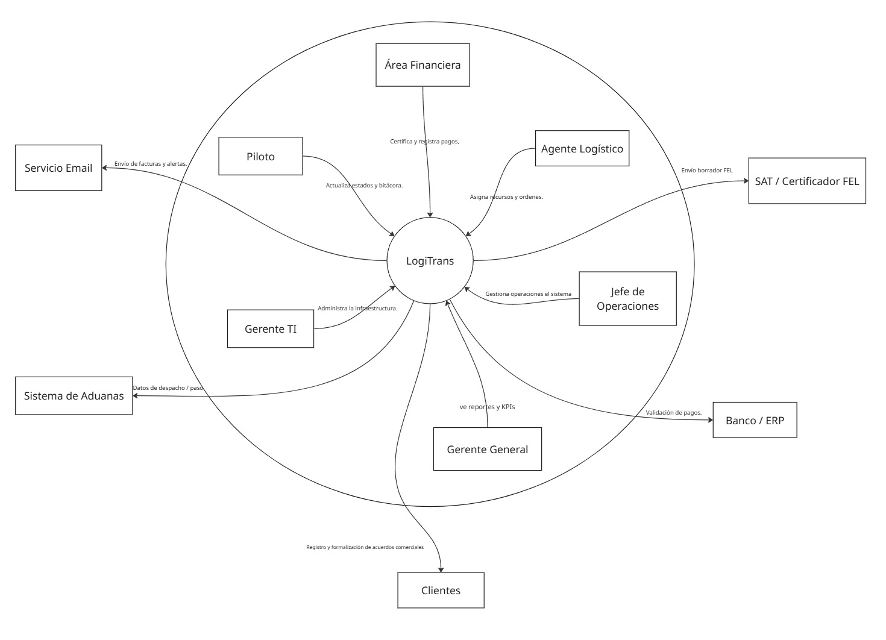
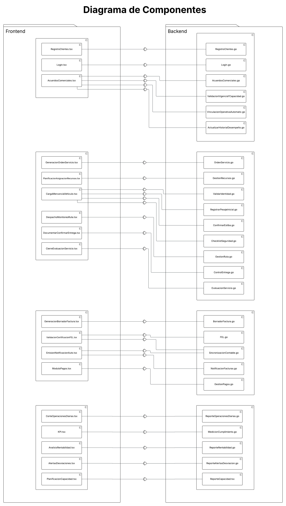
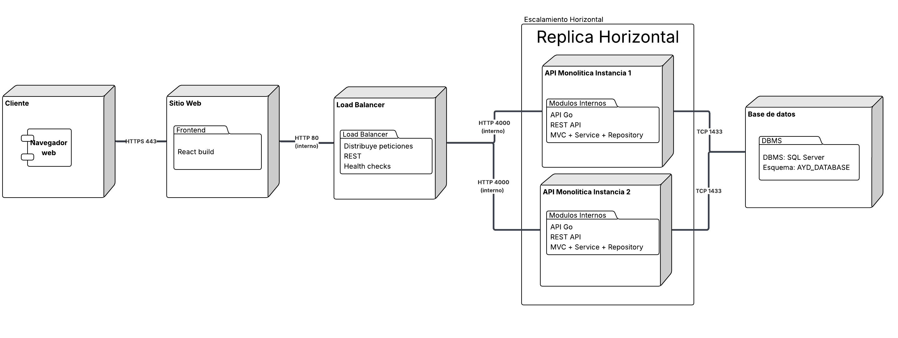
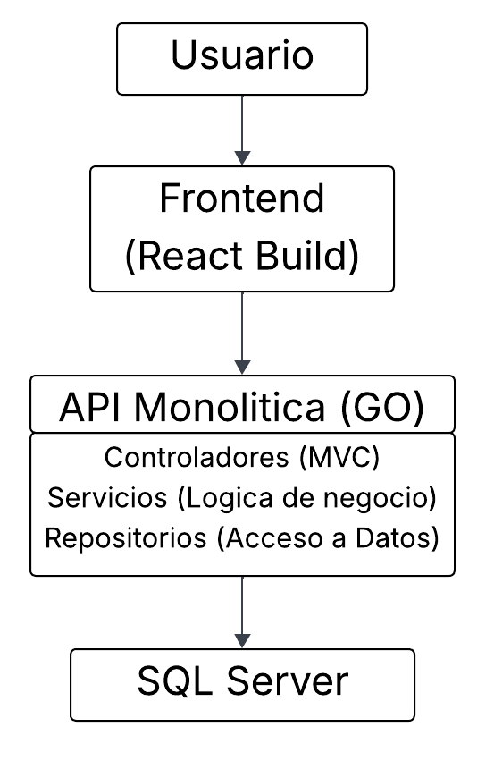

# UNIVERSIDAD DE SAN CARLOS DE GUATEMALA  
## FACULTAD DE INGENIERÍA  
### Análisis y Diseño de Sistemas 2

---

## Entregable 2: Diagramas Arquitectónicos  
## Sistema: LogiTrans  

# 1. Introducción

Este documento describe la arquitectura del sistema LogiTrans mediante distintos diagramas arquitectónicos que permiten comprender su estructura, funcionamiento e integración con actores internos y sistemas externos. Se presentan los diagramas de Contexto, Componentes, Despliegue y Bloques, junto con la justificación de las decisiones arquitectónicas usadas.

# 2. Diagrama de Contexto

## 2.1 Descripción General

El diagrama de contexto muestra cómo LogiTrans interactúa con los diferentes stakeholders y sistemas externos. El sistema central coordina operaciones logísticas, facturación electrónica, pagos y generación de reportes.

## 2.2 Actores Internos

- Área Financiera
- Agente Logístico
- Jefe de Operaciones
- Gerente General
- Gerente TI
- Piloto
- Clientes

## 2.3 Sistemas Externos

- SAT / Certificador FEL 
- Banco / ERP 
- Sistema de Aduanas 
- Servicio de Email 

## 2.4 Objetivo del Diagrama

Representar el alcance del sistema y sus interacciones externas sin detallar su implementación interna.

# 3. Diagrama de Componentes

## 3.1 Descripción

El diagrama de componentes desglosa los módulos internos del sistema, mostrando la relación entre el Frontend y el Backend, así como la organización por funcionalidades del negocio.

## 3.2 Frontend

Incluye módulos como:

- Registro de Clientes
- Login
- Acuerdos Comerciales
- Generación de Orden de Servicio
- Planificación de Recursos
- Gestión de Carga y Despacho
- Facturación y Pagos
- Reportes y KPIs

## 3.3 Backend 

Organizado por módulos funcionales:

### Gestión Comercial
- RegistroClientes.go
- AcuerdosComerciales.go

### Gestión Operativa
- OrdenServicio.go
- GestionRecursos.go
- GestionRuta.go
- EvaluacionServicio.go

### Facturación y Finanzas
- BorradorFactura.go
- FEL.go
- GestionPagos.go
- NotificacionFacturas.go

### Reportes
- ReporteOperacionesDiarias.go
- ReporteRentabilidad.go
- MedicionCumplimiento.go

Este diseño mantiene una arquitectura monolítica modular, donde cada módulo está organizado por responsabilidad funcional.

# 4. Diagrama de Despliegue

## 4.1 Descripción

El diagrama de despliegue muestra la infraestructura del sistema y cómo los componentes de software se distribuyen en los diferentes nodos.
El usuario accede mediante un navegador web al servidor web que entrega el frontend de la aplicación. Las solicitudes son enviadas a un balanceador de carga que distribuye las peticiones entre múltiples instancias de la API. Finalmente, la API interactúa con un servidor de base de datos dedicado donde se almacena la información del sistema.

## 4.2 Nodos

### Cliente
- Navegador Web

### Servidor Web
- Frontend React (Build de producción)

### Balanceador de Carga
- Distribución de peticiones REST
- Health checks de instancias de aplicación

### Servidor de Aplicación
- API Monolítica en Go
- REST API
- Arquitectura MVC + Service + Repository
- Instancias replicadas para escalamiento horizontal

### Servidor de Base de Datos
- DBMS: SQL Server
- Esquema: AYD_DATABASE

## 4.3 Comunicación

- Cliente → Servidor Web: HTTPS 443
- Servidor Web → Balanceador de Carga: HTTP 80 (interno)
- Balanceador de Carga → API Instancias: HTTP 4000 (interno)
- API → SQL Server: TCP 1433

La base de datos no se encuentra expuesta públicamente y únicamente es accesible desde el servidor de aplicación, lo que contribuye a mejorar la seguridad de la arquitectura.

# 5. Diagrama de Bloques

## 5.1 Descripción

El diagrama de bloques muestra la arquitectura lógica del sistema a alto nivel, destacando el flujo funcional desde el usuario hasta la base de datos.

## 5.2 Flujo Arquitectónico

Usuario  
↓  
Frontend (React Build)  
↓  
API Monolítica (Go)  
- Controladores (MVC)  
- Servicios (Lógica de negocio)  
- Repositorios (Acceso a datos)  
↓  
SQL Server  

Este diagrama expresa el estilo arquitectónico adoptado y la separación de responsabilidades dentro del sistema.

# 6. Justificación de Decisiones Arquitectónicas

## 6.1 Estilo Arquitectónico

Se adoptó un enfoque de **Monolito Modular** utilizando el patrón **MVC + Service + Repository**. Esta decisión reduce la complejidad inicial, facilita el desarrollo y aprovecha el conocimiento previo del equipo.

## 6.2 Separación de Responsabilidades

La arquitectura separa claramente:

- Presentación (Frontend React)
- Controladores (Gestión de solicitudes HTTP)
- Servicios (Reglas de negocio)
- Repositorios (Persistencia de datos)
- Base de datos (SQL Server)

Esto mejora la mantenibilidad y la organización del código.

## 6.3 Seguridad

- Uso de HTTPS para comunicación externa.
- API accesible únicamente a través del servidor web.
- Base de datos protegida en red interna.
- Puerto 1433 no expuesto a internet.

## 6.4 Escalabilidad

La API monolítica puede escalar horizontalmente mediante replicación de instancias en caso de incremento de carga.

## 6.5 Disponibilidad

La separación por capas permite incorporar balanceadores de carga y replicación de base de datos en futuras mejoras.

# 7. Conclusión

La arquitectura seleccionada para LogiTrans cumple con los drivers de calidad definidos: seguridad, mantenibilidad, disponibilidad y escalabilidad. El diseño modular dentro de un monolito permite equilibrio entre simplicidad estructural y organización interna del sistema.