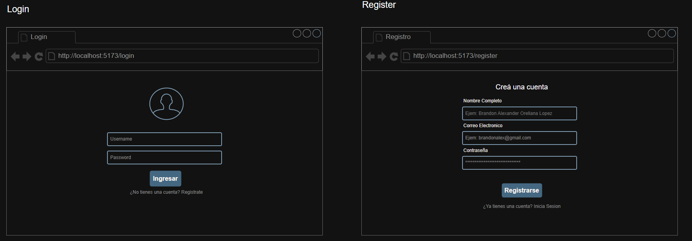
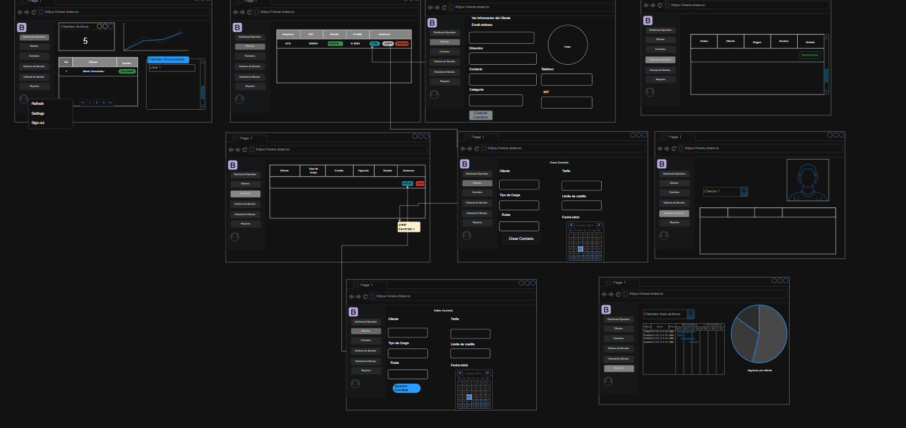
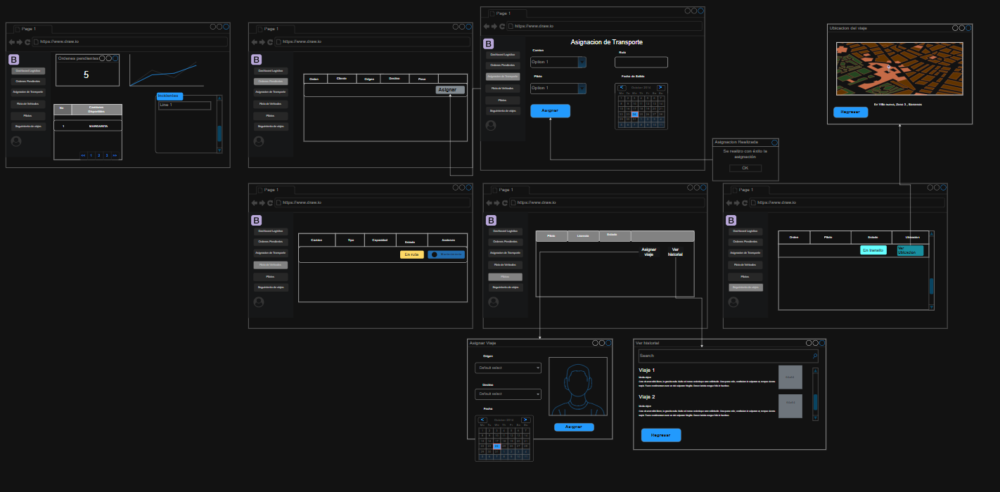
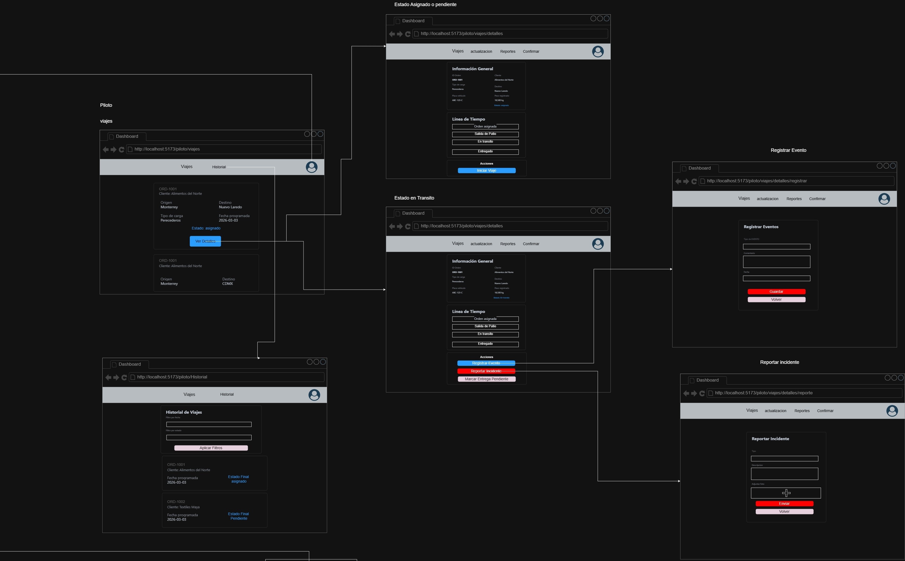
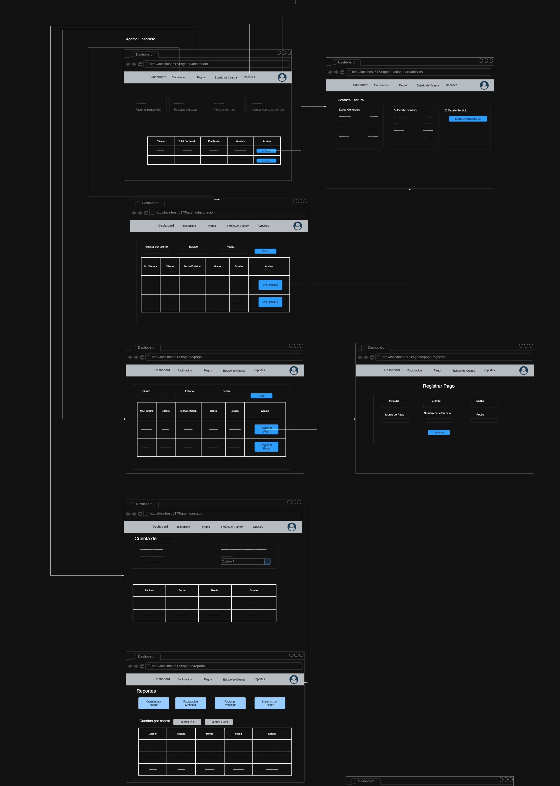
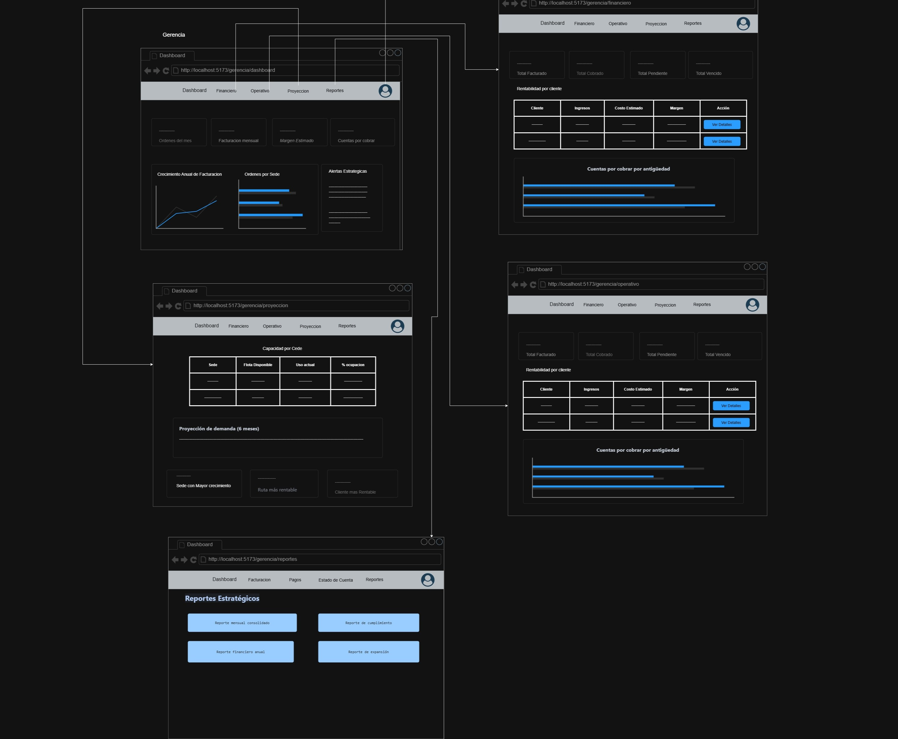
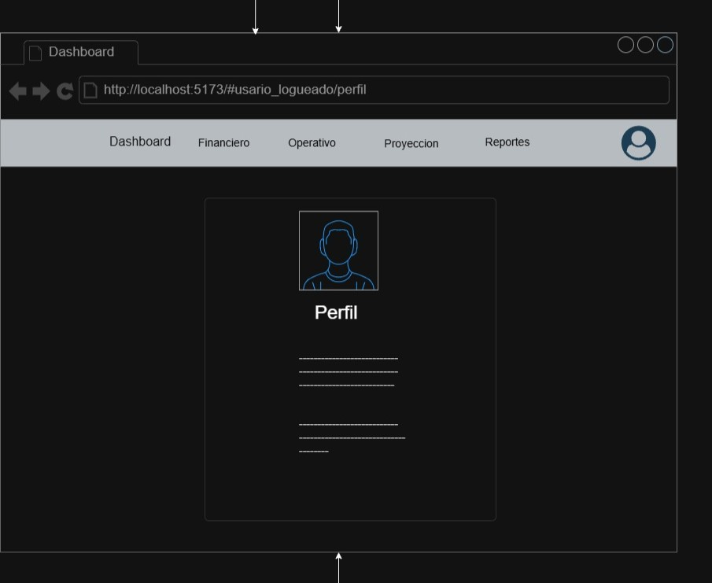
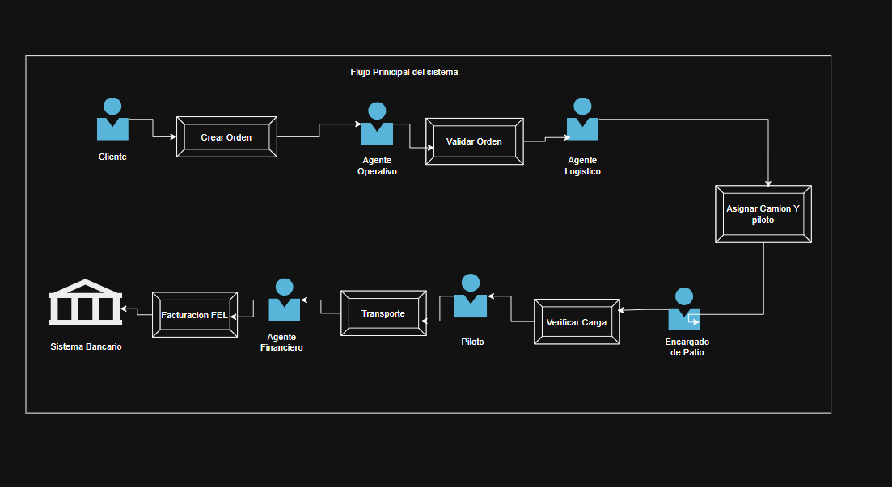

## Login y Registro

Estos dos presentan las pantallas de autenticación del sistema, donde los usuarios pueden iniciar sesión o registrarse en la plataforma.

## Cliente

Mockup que muestra la interfaz específica para el rol de Cliente, presentando las funcionalidades y vistas disponibles para los usuarios que utilizan el servicio de transporte de la plataforma.

## Encargado del Patio

Mockup que presenta la interfaz para el rol de Encargado del Patio, mostrando las funcionalidades específicas para el personal encargado de gestionar el patio de operaciones. Este rol es responsable de:

* Validar IDs de órdenes
* Registrar el proceso de carga
* Confirmar la estiba
* Realizar checklist de seguridad antes del despacho
* Registrar pesos reales de la carga

## Agente Operativo

Los mockups del agente operativo representan las interfaces del sistema destinadas a la gestión administrativa de clientes y contratos. A través de estas pantallas, el agente puede registrar y administrar clientes, crear y gestionar contratos de servicio, y revisar o aprobar las órdenes generadas por los clientes. Estos mockups muestran cómo el sistema permite controlar las condiciones comerciales, como límites de crédito y vigencia de contratos, asegurando que las operaciones cumplan con las políticas de la empresa.

## Agente Logistico

Los mockups del agente logístico representan las interfaces del sistema enfocadas en la planificación y ejecución de las operaciones de transporte. En estas pantallas se gestionan las órdenes aprobadas, se asignan vehículos y pilotos disponibles, y se supervisa el estado de los viajes. Los mockups ilustran cómo el sistema permite coordinar la flota y el personal operativo para garantizar que los servicios de transporte se realicen de manera eficiente y organizada.

## Piloto

En este apartado usted puede visualizar los diferentes caminos que tendra el usuario piloto luego de inicio de sesion de la misma manera de puede apreciar el flujo con las diferentes ventanas.

## Agente Financiero

En este apartado usted puede visualizar las ventanas que usara dicho Agente Financiero, en la misma puede visualizar el flujo que tienen entre las diferentes ventanas

## Gerencia

Visualiza las diferentes ventana que usara dicho usuario de la Gerencia una vez iniciado sesion, el flujo y conexion entre ventana de puede ver en dicha imagen

## Perfil de Piloto, Agente y Gerencia

Cada uno de los descritos anteriormente tendra este estilo de perfil caracteristico, claro con la imformacion que le corresponde a cada usuario

## Flujo Principal del Sistema

El flujo principal del sistema describe el proceso mediante el cual se gestiona un servicio de transporte desde la solicitud del cliente hasta la facturación del servicio. El proceso inicia cuando el cliente crea una orden dentro del sistema. Posteriormente, el agente operativo valida la orden para verificar que cumpla con las condiciones establecidas en el contrato. Una vez aprobada, el agente logístico planifica la operación asignando el camión y el piloto responsable del transporte.

Luego, el encargado de patio verifica la carga antes de autorizar la salida del vehículo. El piloto realiza el transporte hacia el destino establecido. Una vez completado el servicio, el área financiera procede a generar la factura electrónica mediante el sistema de facturación FEL. Finalmente, el proceso se completa con el registro del pago a través del sistema bancario.